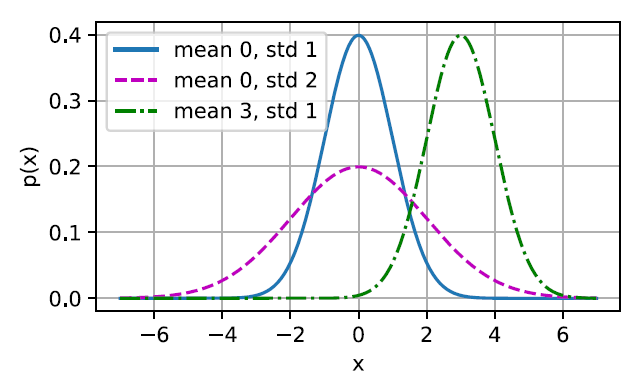

# Preliminaries

## Data Preprocessing

### Reading the Dataset

```python
import pandas as pd

data = pd.read_csv(data_file)
```

### Handling Missing Data

To handle missing data, typical methods include `imputation` and `deletion`, where imputation replaces missing values witrh substituted ones, while deletion ignores missing values.

```python
inputs, outputs = data.iloc[:, 0:2], data.iloc[:, 2] # assume that columns 0 and 1 are features, column index 2 is the target value
inputs = inputs.fillna(inputs.mean()) # use mean value as the imputation value
```

`NaN` in Categorical or discrete values will be considered as a category.

```python
inputs = pd.get_dummies(inputs, dummy_na=True)
```

# Linear Neural Networks

## Linear Regression 

`Regression` problems pop up whenever we want to predict a numerical value. `Linear Regression` assumes that the relationship between features `X` and target `y` is approximately linear, i.e., `E[Y|X=x]` can be expressed as a weighted sum of the features `x`.

### Minibatch Stochastic Gradient Descent

Steps of the algorithm are the following:

1. We initialize the values of the model parameters, typically at random;
2. We iteratively sample random minibatches from the data, updating the parameters in the direction of the negative gradient.

### The Normal Distribution and Squared Loss

Linear regression was invented by Gauss in 1795, who also discovered the normal distributed (also called the `Gaussian`).

Below we define a Python function to compute the normal distribution.

```python
def normal(x, mu, sigma):
    p = 1 / math.sqrt(2 * math.pi * sigma ** 2)
    return p * np.exp(-0.5/sigma ** 2 * (x - mu) ** 2)
```

We can now visualize the normal distributions.

```python
# Use numpy again for visualization
x = np.arange(-7, 7, 0.01)

# Mean and standard deviation pairs
params = [(0, 1), (0, 2), (3, 1)]
d2l.plot(x, [normal(x, mu, sigma) for mu, sigma in params], xlabel='x', 
        ylabel='p(x)', figsize=(4.5, 2.5),
        legend=[f'mean {mu}, std {sigma}' for mu, sigma in params])
```



Since for linear regression, every input is connected to every output (in this case there is only one output), we can regard this information as a `fully-connected layer` or `dense layer`.

### Linear Regression Implementation from Scratch

While modern deep learning frameworks can automate nearly all of this work, implementing things from scratch is the only way to make sure that you really know what you are doing.

```python
%matplotlib inline
import random
import torch
from d2l import torch as d2l
```

#### Generating the Dataset

To keep things simple, we will construct an artificial dataset according to a linear model with additive noise. Our task will be to recover this model's parameters using the finite set of examples contained in our dataset.

```python
def synthetic_data(w, b, num_examples):
    X = torch.normal(0, 1, (num_examples, len(w)))
    y = torch.matmul(X, w) + b
    y += torch.normal(0, 0.01, y.shape) # noise
    return X, y.reshape((-1, -1))
```

#### Reading the Dataset

In the following code, we define the `data_iter` function to demonstrate one possible implementation of this functionality. The function takes a batch size, a matrix of features, and a vector of labels, yielding minibatches of the size `batch_size`. Each minibatch consists of a tuple of features and labels.

```python
def data_iter(batch_size, features, labels):
    num_examples = len(features)
    indices = list(range(num_examples))
    random.shuffle(indices)
    for i in range(0, num_examples, batch_size):
        batch_indices = torch.tensor(
            indices[i : min(i + batch_size, num_examples)])
        yield features[batch_indices], labels[batch_indices]
```

#### Initializing Model Parameters

In the following code, we initialize weights by sampling random number from a normal distribution with mean 0 and a standard deviation of 0.01, and setting the bias to 0.

```python
w = torch.normal(0, 0.01, size=(2, 1), requires_grad=True)
b = torch.zeros(1, requires_grad=True)
```

#### Defining the Model

```python
def linreg(X, w, b):
    """The linear regression model"""
    return torch.matmul(X, w) + b
```

#### Defining the Loss Function

```python
def squared_loss(y_hat, y):
    return (y_hat - y.reshape(y_hat.shape)) ** 2 / 2
```

#### Defining the Optimization Algorithm

```python
def sgd(params, lr, batch_size):
    with torch.no_grad():
        for param in params:
            param -= lr * param.grad / batch_size
            param.grad.zero_()
```

#### Training

In the summary, we will execute the following loop:
- Initialize parameters (w, b)
- Repeat until done
  - Compute gradient g
  - Update parameters

In each epoch, we will iterate through the entire dataset.

```python
lr = 0.03
num_epochs = 3
net = linreg
loss = squared_loss
```

```python
for epoch in range(num_epochs):
    for X, y in data_iter(batch_size, features, labels):
        l = loss(net(X, w, b), y) # Minibatch loss in X and y
        # Compute gradient on l with respect to [w, b]
        l.sum().backward()
        sgd([w, b], lr, batch_size) # Update parameters using their gradient
    with torch.no_grad():
        train_l = loss(net(features, w, b), labels)
        print(f'epoch {epoch + 1}, loss {float(train_l.mean()): f}')
```


### Concise Implementation of Linear Regression

In this section, we will show you how to implement the linear regression model concisely by using high-level APIs of deep learning frameworks.

#### Generating the Dataset

```python
true_w = torch.tensor([2, -3.4])
true_b = 4.2
features, labels = d2l.synthetic_data(true_w, true_b, 10000)
```

#### Reading the Dataset

```python
from torch.utils import data

def load_array(data_arrays, batch_size, is_train=True):
    dataset = data.TensorDataset(*data_arrays)
    return data.DataLoader(dataset, batch_size, shuffle=is_train)
```

```python
batch_size = 10
data_iter = load_array((features, labels), batch_size)
```

Here we use `iter` to construct a Python iterator and use `next` to obtain the first item from the iterator.

```python
next(iter(data_iter))
```

#### Defining the Model

```python
from torch import nn

net = nn.Sequential(nn.Linear(2, 1)) # 2: input size, 1: output size
```

#### Initializing Model Parameters

Before using `net`, we need to initialize the model parameters, such as the weights and bias in the linear regression model. 

```python
net[0].weights.data.normal_(0, 0.01)
net[0].bias.data.fill_(0)
```

#### Defining the Loss Function

```python
loss = nn.MSELoss()
```

#### Defining the Optimization Algorithm

```python
trainer = torch.optim.SGD(net.parameters, lr=0.03)
```

#### Training

```python
num_epochs = 3
for epoch in range(num_epochs):
    for X, y in data_iter:
        l = loss(net(X), y)
        trainer.zero_grad()
        l.backward()
        trainer.step()
    l = loss(net(features), labels)
    print(f'epoch {epoch + 1}, loss {l: f}')
```

## Softmax Regression

### The Image Classification Dataset

One of the widely used dataset for image classification is the `MNIST` dataset. We will focus on our discussion in the comming sections on the qualitatively similar, but comparatively complex `Fashion-MNIST` dataset.

```python
from torchvision import transforms

def load_data_fashion_mnist(batch_size, resize=None):
    """Download the Fashion-MNIST dataset and then load it into memory"""
    trans = [transforms.ToTensor()]
    if resize:
        trans.insert(0, transforms.Resize(resize))
    trans = transforms.Compose(trans)
    mnist_train = torchvision.datasets.FashionMNIST(root="./data", train=True, transform=trans, download=True)
    mnist_test = torchvision.datasets.FashionMNIST(root="./data", train=False, transform=trans, download=True)
    return (data.DataLoader(mnist_train, batch_size, shuffle=True, num_workers=4),
            data.DataLoader(mnist_test, batch_size, shuffle=False, num_workers=4))
```

### Implementation of Softmax Regression from Scratch

#### Initializing Model Parameters

Each example in the raw dataset is a 28 $\times$ 28 image. In this section, we will flatten each image, treating them as vectors of length 784. Recall that in Softmax regression, we have as many outputs as there are classes. Because our dataset has 10 classes, our network will have an output dimension of 10. Consequently, our weights will constitute a 784 $\times$ 10 matrix and the biases will constitute a 1 $\times$ 10 row vector. 

```python
num_inputs = 784
num_outputs = 10

W = torch.normal(0, 0.01, size=(num_inputs, num_outputs), requires_grad=True)
b = torch.zeros(num_outputs, requires_grad=True)
```

#### Defining the Softmax Operation

```python
def softmax(X):
    X_exp = torch.exp(X)
    partition = X_exp.sum(1, keepdim=True)
    return X_exp / partition # broadcasting mechanism
```

As you can see, for any random input, we turn each element into a non-negative number. Moreover, each row sums up to 1, as is required for a probability.

```python
X = torch.normal(0, 1, (2, 5))
X_prob = softmax(X)
X_prob, X_prob.sum(1)
```

Note that while this looks correct mathematically, we were a bit sloppy in our implementation because we failed to take precautions against numerical overflow or underflow due to large or very small elements of the matrix.

#### Defining the Model

```python
def net(X):
    return softmax(torch.matmul(X.reshape((-1, W.shape[0])), W) + b)
```

#### Defining the Loss Function

```python
def cross_entropy(y_hat, y):
    return -torch.log(y_hat[range(len(y_hat)), y])

cross_entropy(y_hat, y)
```

#### Classification Accuracy

Given the predicted probability distribution `y_hat`, we typically choose the class with the highest predicted probability whenever we must output a hard prediction.

```python
def accuracy(y_hat, y):
    """Compute the number of correct predictions"""
    if len(y_hat.shape) > 1 and y_hat.shape[1] > 1:
        y_hat = y_hat.argmax(axis=1)
    cmp = y_hat.type(y.dtype) == y
    return float(cmp.type(y.dtype).sum())
```

```python
def evaluate_accuracy(net, data_iter):
    """Compute the accuracy for a model on a dataset."""
    if isinstance(net, torch.nn.Module):
        net.eval() # set the model to evaluation mode
    metric = Accumulator(2) # No. of correct predictions, no. of predictions

    with torch.no_grad():
        for X, y in data_iter:
            metric.add(accuracy(net(X), y), y.numel())
    return metric[0] / metric[1]
```

Here `Accumulator` is a utility class to accumulate sums over multiple variables.

```python
class Accumulator:
    """For accumulating sums over n variables."""
    def __init__(self, n):
        self.data = [0.0] * n

    def add(self, *args):
        self.data = [a + float(b) for a, b in zip(self.data, args)]
    
    def reset(self):
        self.data = [0.0] * len(self.data)
    
    def __getitem__(self, idx):
        return self.data[idx]
```

#### Training

First, we define a function to train for one epoch. Note that `updater` is a general function to update the model parameters, which accepts the batch size as an argument. It can be either a wrapper of the `d2l.sgd` function or a framework's built-in optimization function.

```python
def train_epoch(net, train_ieter, loss, updater):
    # Set the model to training mode
    if isinstance(net, torch.nn.Module):
        net.train()
    # Sum of training loss, sum of training accuracy, no. of examples
    metric = Accumulator(3)
    for X, y in train_iter:
        # Compute gradients and update parameters
        y_hat = net(X)
        l = loss(y_hat, y)
        if isinstance(updater, torch.optim.Optimizer):
            # Using PyTorch in-built optimizer & loss criterion
            updaer.zero_grad()
            l.mean().backward()
            updater.step()
        else:
            # Using custom built optimizer & loss criterion
            l.sum().backward()
            updater(X.shape[0])
        metric.add(float(l.sum()), accuracy(y_hat, y), y.numel())
    
    # Return training loss and training accuracy
    return metric[0] / metric[2], metric[1] / metric[2]
```

# Multilayer Perceptrons

