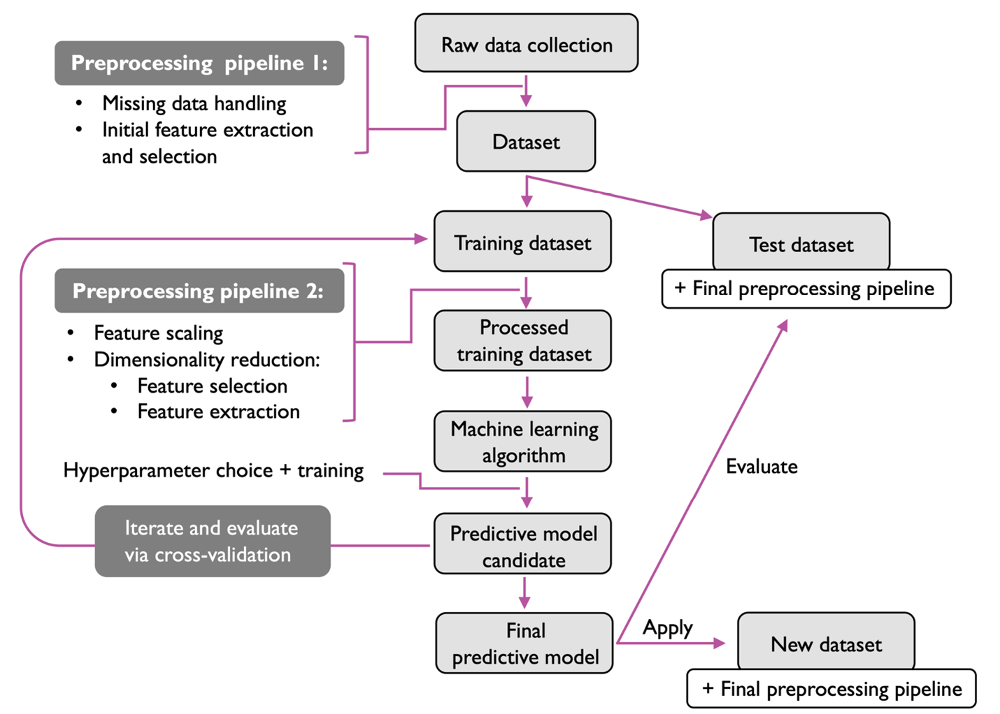
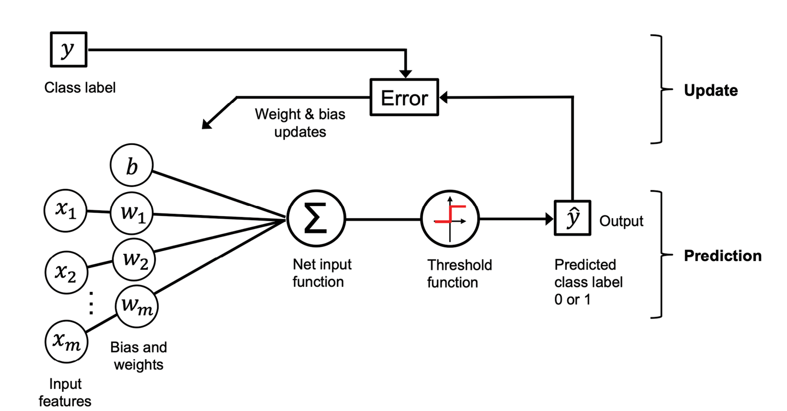

# Machine Learing with Pytorch and Scikit-Learn

## Chapter 1: Giving Computers the Ability to Learn from Data



### Training Simple Machine Learning Algorithms for Classification



```python
import numpy as np

class Perceptron:
    """Perceptron classifier.
    
    Parameters
    ------------
    eta : float
      Learning rate (between 0.0 and 1.0)
    n_iter : int
      Passes over the training dataset.
    random_state : int
      Random number generator seed for random weight 
      initialization.
    
    Attributes
    -----------
    w_ : 1d-array
      Weights after fitting.
    b_ : Scalar
      Bias unit after fitting.
    errors_ : list
      Number of misclassifications (updates) in each epoch.
    
    """
    def __init__(self, eta=0.01, n_iter=50, random_state=1):
        self.eta = eta
        self.n_iter = n_iter
        self.random_state = random_state
    
    def fit(self, X, y):
        """Fit training data.
        
        Parameters
        ----------
        X : {array-like}, shape = [n_examples, n_features]
          Training vectors, where n_examples is the number of 
          examples and n_features is the number of features.
        y : array-like, shape = [n_examples]
          Target values.
        
        Returns
        -------
        self : object
        
        """
        rgen = np.random.RandomState(self.random_state)
        self.w_ = rgen.normal(loc=0.0, scale=0.01,
                              size=X.shape[1])
        self.b_ = np.float_(0.)
        self.errors_ = []
        
        for _ in range(self.n_iter):
            errors = 0
            for xi, target in zip(X, y):
                update = self.eta * (target - self.predict(xi))
                self.w_ += update * xi
                self.b_ += update
                errors += int(update != 0.0)
            self.errors_.append(errors)
        return self
    
    def net_input(self, X):
        """Calculate net input"""
        return np.dot(X, self.w_) + self.b_
    
    def predict(self, X):
        """Return class label after unit step"""
        return np.where(self.net_input(X) >= 0.0, 1, 0)
```

## Chapter 2: Training Simple Machine Learning Algorithms for Classification


## Chapter 3: A Tour of Machine Learning CLassifiers Using Scikit-Learn

## Chapter 4: Building Good Training Datasets

## Chapter 5: Compressing Data via Dimensionality Reduction

## Chapter 6: Learning Best Practices for Model Evaluation and Hyperparameter

## Chapter 7: Combining Different Models for Ensemble Learning

## Chapter 8: Applying Machine Learning to Sentiment Analysis

## Chapter 9: Predicting Continuous Target Variables with Regression Analysis

## Chapter 10: Working with Unlabeled Data

## Chapter 11: Implementing a Multilayer Artificial Neural Network from Scratch

## Chapter 12: Parallelizing Neural Network Training with Pytorch

## Chapter 13: Going Deeper - The Mechanics of PyTorch

## Chapter 14: CLassifying Images with Deep COnvolutional Neural Networks

## Chapter 15: Modeling Sequential Data Using Recurrent Neural Networks

## Chapter 16: Transformers

## Chapter 17: Generative Adversarial Networks for Synthesizing New Data

## Chapter 18: Graph Neural Networks for Capturing Dependencies in Graph Structured Data

## Chapter 19: Reinforcement Learning for Decision Making in Complex Environments