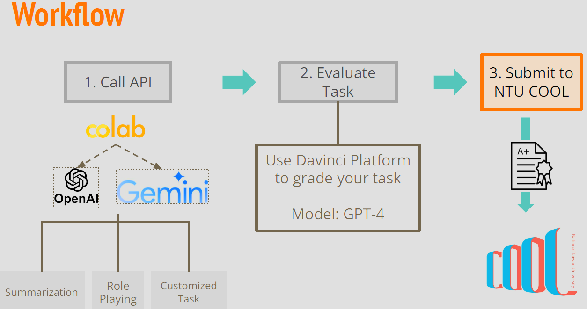

# GenAI HW2：都是AI的作文比赛

## 目标

1. 学习如何调用ChatGPT API
2. 学习如何设计prompts来实现功能

## 任务



1. Summarization
2. Role Playing
3. Customized Task

Colab link to this homework: [https://colab.research.google.com/drive/15jh4v_TBPsTyIBhi0Fz46gEkjvhzGaBR?usp=sharing](https://colab.research.google.com/drive/15jh4v_TBPsTyIBhi0Fz46gEkjvhzGaBR?usp=sharing)

> 很遗憾，我的OpenAI账户没有quota了，所以只能使用Gemini。如果可能的话，还是建议使用OpenAI。

### 1. Summarization

> 目标：设计prompt让语言模型生成文本摘要。

#### Input

With house prices soaring, it's not easy finding somewhere to live. And this community has thrown in the towel. Meet Seattle's rolling neighborhood of RVs, where each unassuming vehicle is a capsule home. The unusual format has been captured in a series of photographs by visual journalist Anna Erickson. Meet Bud Dodson, 57, and welcome to his home: An RV in Seattle's SoDo where he watches over the parking lot in exchange for a spot . No place like home: John Warden, 52, has turned his $200 vehicle into his home after his apartment burned down years ago . There are around 30 drivers that float in and out of this parking lot in the SoDo (South of Downtown) area of the city in Washington State. One might not notice them in the mornings as hundreds of workers in the nearby factories, such as Starbucks, park up and rush into work. But on the weekends, as the rabble flocks back to their beds, this unique group remains. John Worden, 52, has been living in his vehicle for years since his apartment burned down and he was left homeless. He told Anna his car cost $200, and doesn't drive very well. But for a home, it's just about enough. Though plan on the outside, it is a Pandora's Box inside, Anna tells DailyMail.com. 'It was scattered with trinkets that he had been collecting over the years,' she explained, 'and a pile of beer cans that he was saving to turn in for money.' For work, he panhandles while helping people find parking spaces at Safeco Field stadium, where he used to be a cook. People come and go for work in the factories nearby, but on the weekend it is just the RV-dwellers that area left . Daily life: Here Bud can be seen preparing himself a barbecue on the gravel outside his capsule home, one of about 30 in the community . Eclectic: While Bud's RV is organized and functional, John's is full of trinkets and belongings dating back years . Alongside him - most of the time - is Bud Dodson, 57. While some are forced to move about regularly, Dodson, a maintenance man, looks after the parking lot in exchange for a semi-permanent spot. His home has its own unique stamp on it. 'He had really made the RV his home and taken good care of it,' Anna described. 'It was more functional [than John's] and a cleaner space with a bed, kitchen and bathroom.' Whether organized or eclectic, however, each one is home. 'None of them seem to want to move on,' Anna said. 'It's not perfect but they seem pretty content. Move in, move out: Some have agreements to stay, but others have to keep driving around to find a spot . John works as a panhandler at Safeco Fields stadium, where he used to work as a cook . He is content with his life in between the usual confines of society . Personal: To many this may just seem like a parking lot but for these men it is a very personal space . 'Bud is very grateful, he said the parking lot owner is just such a nice guy to let him live like this.' She came across them when she stopped to ask a seemingly homeless man for directions. 'We got talking,' she said, 'and he mentioned that he lived nearby in an RV. I went round to look and there was a whole bunch of them.' Curious, she spent about two months returning to the spot, meeting with the community and building their trust. 'These RVs are their homes so it's a very personal thing,' she explained.


#### Gemini Outputs

> temperature=0.7

Seattle's SoDo neighborhood has become home to a community of RV dwellers, with about 30 vehicles parked in a lot. These residents have created a unique enclave, with each RV serving as a capsule home. Bud Dodson, a maintenance man, watches over the lot in exchange for a permanent spot, while John Warden, a former cook, lives in his $200 RV since losing his apartment. The RVs range from organized and functional to eclectic and cluttered, but all provide shelter and a sense of community for their occupants. Despite the unconventional living situation, the residents seem content and grateful for the opportunity to have a place to call home.

> temperature=1.0

Seattle's SoDo district has become an unusual neighborhood of RVs, each serving as a capsule home for its occupant. Anna Erickson's photographs capture this unique community, highlighting the stories of Bud Dodson and John Warden. Dodson, a maintenance man, has a semi-permanent spot in exchange for watching over the parking lot. His RV is organized and functional, while Warden's is cluttered with memorabilia. Despite the challenges of RV living, including a lack of privacy and amenities, the residents seem content. They have created a community where they support each other and have developed a sense of home within their unconventional dwellings.

> temperature=0.2

In Seattle's SoDo neighborhood, a community of approximately 30 individuals reside in RVs, forming a unique "rolling neighborhood." Bud Dodson, a maintenance man, watches over the parking lot in exchange for a semi-permanent spot in his organized RV. John Warden, a former cook, lives in his $200 vehicle after losing his apartment in a fire. His RV is filled with trinkets and belongings. Despite the challenges of living in RVs, the residents seem content with their situation. They have formed a community and appreciate the support of the parking lot owner.


### 2. Role Playing

> 目标：与LM玩角色扮演游戏，互动2轮。

> Please act as a pirate and play a role play game with me

Avast there, matey! I be Captain Jack, the terror of the seven seas. Prepare yerself for a swashbuckling adventure.

> What are you going to do next

Avast there, matey! Captain Jack here, ready to set sail on a new adventure. What be yer fancy? Shall we plunder a Spanish galleon laden with gold, or search for the lost city of El Dorado? The choice be yours, me hearty!

> I would prefer the lost city of El Dorado

Avast there, matey! Captain Jack here, ready to set sail for the lost city of El Dorado. Legends tell of a city of gold, hidden deep in the heart of the Amazon rainforest. But be warned, me hearty, the journey be fraught with peril. We'll face treacherous jungles, raging rivers, and ancient curses. But fear not, for Captain Jack be a seasoned adventurer, and together we'll uncover the secrets of El Dorado!

### 3. Customize Task

> 目标：自定义一个service bot，互动不超过3轮。

```python
chatbot_task="Help me plan anything, list out step-by-step instructions"
prompt_for_task = "Teach me to be a great tennis player"
```

> Teach me to be a great tennis player, give me step-by-step instructions


Step 1: Master the Basics

    Grip: Use the Eastern or Semi-Western grip for control and spin.
    Stance: Keep your feet shoulder-width apart, knees bent, and body balanced.
    Swing: Focus on a smooth and fluid swing, with a full backswing and follow-through.

Step 2: Develop Your Groundstrokes

    Forehand: Step into the ball, swing up and over it with a topspin motion.
    Backhand: Keep the racket low, swing up and around the ball with a slice or two-handed motion.
    Practice consistently: Hit thousands of balls to improve your accuracy and consistency.

Step 3: Improve Your Serve

    Stance: Stand behind the baseline, feet shoulder-width apart.
    Toss: Toss the ball high enough for you to hit it at its peak.
    Swing: Serve with power and accuracy, aiming for the corners of the court.
    Variations: Master flat, topspin, and slice serves to keep your opponents guessing.

Step 4: Work on Your Volleys

    Footwork: Approach the net quickly and adjust your position to intercept the ball.
    Technique: Hit the ball in front of you with a short and controlled stroke.
    Positioning: Stay close to the net to prevent your opponent from passing you.

Step 5: Enhance Your Court Coverage

    Footwork: Move efficiently around the court, covering all angles.
    Anticipation: Read your opponent's shots and position yourself accordingly.
    Endurance: Build stamina to play long rallies and extend points.

Step 6: Develop Your Mental Game

    Focus: Stay present and concentrated during the match.
    Positive Attitude: Believe in yourself and your abilities.
    Resilience: Embrace challenges and learn from your mistakes.

Step 7: Get Coaching and Practice

    Find a Coach: A qualified coach can provide personalized instruction and help you improve your technique.
    Regular Practice: Practice several hours per week to develop your skills and muscle memory.
    Match Play: Challenge yourself against opponents to apply your skills in real-world situations.

Additional Tips:

    Study the Game: Watch professional matches and analyze their techniques.
    Use Technology: Utilize video analysis and tracking devices to monitor your progress.
    Stay Healthy: Maintain a healthy diet, get enough sleep, and stretch regularly.
    Have Fun: Enjoy the game and the competition.


> Can you list out the techniques I should practice 

Essential Tennis Techniques to Practice:

Groundstrokes:

    Forehand topspin
    Backhand topspin
    Forehand slice
    Backhand slice

Serves:

    Flat serve
    Topspin serve
    Slice serve

Volleys:

    Forehand volley
    Backhand volley
    Overhead volley

Other Techniques:

    Footwork:
        Lateral movement
        Forward and backward movement
        Cross-court movement
    Court Coverage:
        Anticipation
        Positioning
    Spin:
        Topspin
        Slice
    Lob: Hitting the ball high over the opponent's head
    Drop Shot: Hitting the ball softly and short, just over the net
    Overhead Smash: Hitting the ball powerfully overhead, usually on a high ball

Additional Tips:

    Practice each technique consistently to develop accuracy and consistency.
    Use a variety of drills and exercises to improve your skills.
    Seek feedback from a qualified coach to refine your technique.
    Analyze your matches and identify areas for improvement.
    Study the techniques of professional players to learn from the best.

## 代码阅读

代码以OpenAI访问为示例。

```python
# import the packages
import openai
import gradio as gr
import json
from typing import List, Dict, Tuple

## TODO: Fill in your OpenAI api in the "" part
OPENAI_API_KEY = "FILL IN YOUR API KEY"
client = openai.OpenAI(api_key=OPENAI_API_KEY)

# Check if you have set your ChatGPT API successfully
# You should see "Set ChatGPT API sucessfully!!" if nothing goes wrong.
try:
  response = client.chat.completions.create(
            model="gpt-3.5-turbo",
            messages = [{'role':'user','content': "test"}],
            max_tokens=1,
  )
  print("Set ChatGPT API sucessfully!!")
except:
  print("There seems to be something wrong with your ChatGPT API. Please follow our demonstration in the slide to get a correct one.")
```

这段代码通过API Key调用OpenAI chat。

### 1. Summarization

```python
## TODO: Input the prompt in the ""
prompt_for_summarization = "FILL IN YOUR PROMPT"

# function to call the model to generate
def interact_summarization(prompt: str, article: str, temp = 1.0) -> List[Tuple[str, str]]:
    '''
    * Arguments
      - prompt: the prompt that we use in this section
      - article: the article to be summarized
      - temp: the temperature parameter of this model. Temperature is used to control the output of the chatbot.
              The higher the temperature is, the more creative response you will get.
    '''
    input = f"{prompt}\n{article}"
    response = client.chat.completions.create(
            model="gpt-3.5-turbo",
            messages = [{'role':'user','content': input}],
            temperature = temp,
            max_tokens=200,
    )

    return [(input, response.choices[0].message.content)]

# this part generates the Gradio UI interface
with gr.Blocks() as demo:
    gr.Markdown("# Part1: Summarization\nFill in any article you like and let the chatbot summarize it for you!!")
    chatbot = gr.Chatbot()
    prompt_textbox = gr.Textbox(label="Prompt", value=prompt_for_summarization, visible=False)
    article_textbox = gr.Textbox(label="Article", interactive = True, value = "TEST TEXT")
    with gr.Column():
        gr.Markdown("#  Temperature\n Temperature is used to control the output of the chatbot. The higher the temperature is, the more creative response you will get.")
        temperature_slider = gr.Slider(0.0, 2.0, 1.0, step = 0.1, label="Temperature")
    with gr.Row():
        sent_button = gr.Button(value="Send")
        reset_button = gr.Button(value="Reset")

    with gr.Column():
        gr.Markdown("#  Save your Result.\n After you get a satisfied result. Click the export button to recode it.")
        export_button = gr.Button(value="Export")
    sent_button.click(interact_summarization, inputs=[prompt_textbox, article_textbox, temperature_slider], outputs=[chatbot])
    reset_button.click(reset, outputs=[chatbot])
    export_button.click(export_summarization, inputs=[chatbot, article_textbox])
```

### 2. Role Playing

```python
# TODO: Fill in the below two lines: character_for_chatbot and prompt_for_roleplay
# The first one is the character you want your chatbot to play
# The second one is the prompt to make the chatbot be a certain character
character_for_chatbot = "FILL IN YOUR CHARACTER"
prompt_for_roleplay = "FILL IN YOUR PROMPT"

# function to clear the conversation
def reset() -> List:
    return []

# function to call the model to generate
def interact_roleplay(chatbot: List[Tuple[str, str]], user_input: str, temp=1.0) -> List[Tuple[str, str]]:
    '''
    * Arguments
      - user_input: the user input of each round of conversation
      - temp: the temperature parameter of this model. Temperature is used to control the output of the chatbot.
              The higher the temperature is, the more creative response you will get.
    '''
    try:
        messages = []
        for input_text, response_text in chatbot:
            messages.append({'role': 'user', 'content': input_text})
            messages.append({'role': 'assistant', 'content': response_text})

        messages.append({'role': 'user', 'content': user_input})

        response = client.chat.completions.create(
            model="gpt-3.5-turbo",
            messages = messages,
            temperature = temp,
            max_tokens=200,
        )
        chatbot.append((user_input, response.choices[0].message.content))

    except Exception as e:
        print(f"Error occurred: {e}")
        chatbot.append((user_input, f"Sorry, an error occurred: {e}"))
    return chatbot

# this part constructs the Gradio UI interface
with gr.Blocks() as demo:
    gr.Markdown(f"# Part2: Role Play\nThe chatbot wants to play a role game with you, try interacting with it!!")
    chatbot = gr.Chatbot(value = first_dialogue)
    description_textbox = gr.Textbox(label=f"The character the bot is playing", interactive = False, value=f"{character_for_chatbot}")
    input_textbox = gr.Textbox(label="Input", value = "")
    with gr.Column():
        gr.Markdown("#  Temperature\n Temperature is used to control the output of the chatbot. The higher the temperature is, the more creative response you will get.")
        temperature_slider = gr.Slider(0.0, 2.0, 1.0, step = 0.1, label="Temperature")
    with gr.Row():
        sent_button = gr.Button(value="Send")
        reset_button = gr.Button(value="Reset")
    with gr.Column():
        gr.Markdown("#  Save your Result.\n After you get a satisfied result. Click the export button to recode it.")
        export_button = gr.Button(value="Export")
    sent_button.click(interact_roleplay, inputs=[chatbot, input_textbox, temperature_slider], outputs=[chatbot])
    reset_button.click(reset, outputs=[chatbot])
    export_button.click(export_roleplay, inputs=[chatbot, description_textbox])
```

### 3. Customized Task

```python
# TODO: Fill in the below two lines: chatbot_task and chatbot_task
# The first is for you to tell the user that the chatbot can perform certain task
# The second one is the prompt that make the chatbot able to do certain task
chatbot_task = "FILL_IN_THE_TASK"
prompt_for_task = "FILL_IN_THE_PROMPT"

# function to call the model to generate
def interact_customize(chatbot: List[Tuple[str, str]], prompt: str ,user_input: str, temperature = 1.0) -> List[Tuple[str, str]]:
    '''
    * Arguments
      - chatbot: the model itself, the conversation is stored in list of tuples
      - prompt: the prompt for your desginated task
      - user_input: the user input of each round of conversation
      - temp: the temperature parameter of this model. Temperature is used to control the output of the chatbot.
              The higher the temperature is, the more creative response you will get.
    '''
    try:
        messages = []
        messages.append({'role': 'user', 'content': prompt})
        for input_text, response_text in chatbot:
            messages.append({'role': 'user', 'content': input_text})
            messages.append({'role': 'assistant', 'content': response_text})

        messages.append({'role': 'user', 'content': user_input})

        response = client.chat.completions.create(
            model="gpt-3.5-turbo",
            messages = messages,
            temperature = temperature,
            max_tokens=200,
        )

        chatbot.append((user_input, response.choices[0].message.content))

    except Exception as e:
        print(f"Error occurred: {e}")
        chatbot.append((user_input, f"Sorry, an error occurred: {e}"))
    return chatbot

# this part constructs the Gradio UI interface
with gr.Blocks() as demo:
    gr.Markdown("# Part3: Customized task\nThe chatbot is able to perform a certain task. Try to interact with it!!")
    chatbot = gr.Chatbot()
    desc_textbox = gr.Textbox(label="Description of the task", value=chatbot_task, interactive=False)
    prompt_textbox = gr.Textbox(label="Prompt", value=prompt_for_task, visible=False)
    input_textbox = gr.Textbox(label="Input")
    with gr.Column():
        gr.Markdown("#  Temperature\n Temperature is used to control the output of the chatbot. The higher the temperature is, the more creative response you will get.")
        temperature_slider = gr.Slider(0.0, 2.0, 1.0, step = 0.1, label="Temperature")
    with gr.Row():
        sent_button = gr.Button(value="Send")
        reset_button = gr.Button(value="Reset")
    with gr.Column():
        gr.Markdown("#  Save your Result.\n After you get a satisfied result. Click the export button to recode it.")
        export_button = gr.Button(value="Export")
    sent_button.click(interact_customize, inputs=[chatbot, prompt_textbox, input_textbox, temperature_slider], outputs=[chatbot])
    reset_button.click(reset, outputs=[chatbot])
    export_button.click(export_customized, inputs=[chatbot, desc_textbox])
```