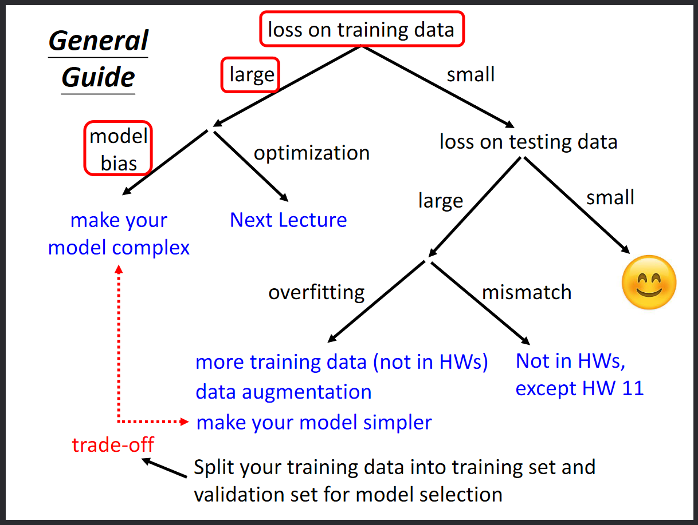

# Machine Learning 2023 Spring: 生成式AI

| Topic  | Course | Optional Materials | Homework | Prerequisite |
| ------------- | ------------- | ------------- | ------------- | ------------ | 
| 正确认识ChatGPT | :point_right: [ChatGPT原理剖析1/3——对ChatGPT的常见误解](https://youtu.be/yiY4nPOzJEg)  [[slides](ML2023-Spring/slides/ChatGPT_basic.pdf)   :point_right: [ChatGPT原理剖析2/3——预训练](https://youtu.be/1ah7Qsri_c8) [[slides](ML2023-Spring/slides/ChatGPT_SSL_(v4).pdf)]   :point_right: [ChatGPT原理剖析3/3——ChatGPT所带来的研究问题](https://youtu.be/UsaZhQ9bY2k) [[slides](ML2023-Spring/slides/ChatGPT_Question_(v2).pdf)]   :point_right: [用ChatGPT和Midjourney来玩文字冒险游戏](https://youtu.be/A-6c584jxX8) [[slides](ML2023-Spring/slides/TextGame_(v2).pdf)]| :point_right: [ChatGPT(可能)是怎么炼成的](https://youtu.be/e0aKI2GGZNg)   :point_right:[Predicting Pokemon CP](https://youtu.be/fegAeph9UaA)   :point_right: [Pokemon classification](https://youtu.be/fZAZUYEeIMg)   :point_right: [Logistic Regression](https://youtu.be/hSXFuypLukA) | **Regression**   [[video](https://www.youtube.com/watch?v=iMzxjBDMvac)] [[pdf](ML2023-Spring/HW01/HW01.pdf)] [[code](ML2023-Spring/HW01/HW01.ipynb)] | Introduction to Deep Learning   [[video 1](https://youtu.be/Ye018rCVvOo)] [[video 2](https://youtu.be/bHcJCp2Fyxs)] [[slides](ML2023-Spring/slides/regression_(v16).pdf)]|
| 机器学习基本概念介绍  | :point_right:[【生成式AI】快速了解机器学习基本原理1/2](https://youtu.be/phQK8xZpgoU) [[slides](ML2023-Spring/slides/ML_basic_(v8).pdf)]    :point_right:[【生成式AI】快速了解机器学习基本原理2/2](https://youtu.be/XLyPFnephpY)   :point_right:[【生成式AI】生成式学习的两种策略：要各个击破，还是要一次到位](https://youtu.be/AihBniegMKg) [[slides](ML2023-Spring/slides/ARandNAR_(v2).pdf)]   :point_right: [【生成式AI】能够使用工具的AI：New Bing, WebGPT, Toolformer](https://youtu.be/ZID220t_MpI) [[slides](ML2023-Spring/slides/NewBing_(v4).pdf)] | :point_right:[Brief Introduction of Deep Learning](https://youtu.be/Dr-WRlEFefw)   :point_right:[Gradient Descent](https://youtu.be/yKKNr-QKz2Q)   :point_right:[Backpropagation](https://youtu.be/ibJpTrp5mcE)   :point_right:[卷积神经网络CNN](https://youtu.be/OP5HcXJg2Aw)   :point_right:[自注意力机制Self-attention(上)](https://youtu.be/hYdO9CscNes)   :point_right:[自注意力机制Self-attention(下)](https://youtu.be/gmsMY5kc-zw) | **Classification**   [[video](https://www.youtube.com/watch?v=GnpLeYSCrjo)] [[pdf](ML2023-Spring/HW02/HW02.pdf)] [[code](ML2023-Spring/HW02/HW02.ipynb)] | What to do if my network fails to train   [[video 1](https://youtu.be/QW6uINn7uGk)] [[video 2](https://youtu.be/zzbr1h9sF54)] [[video 3](https://youtu.be/HYUXEeh3kwY)] [[video 4](https://youtu.be/O2VkP8dJ5FE)] [[video 5](https://youtu.be/BABPWOkSbLE)] |
| 机器如何生成语句  | :point_right:[【生成式AI】Finetuning vs. Prompting：对于大型语言模型的不同期待所衍生的两类适用方式1/3](https://youtu.be/F58vJcGgjt0)   :point_right:[【生成式AI】Finetuning vs. Prompting：对于大型语言模型的不同期待所衍生的两类适用方式2/3](https://youtu.be/aZ_jXZvxyVg)   :point_right:[【生成式AI】Finetuning vs. Prompting：对于大型语言模型的不同期待所衍生的两类适用方式3/3](https://youtu.be/HnzDaEiN_eg)   [[slides](ML2023-Spring/slides/Prompt_(v3).pdf)] | :point_right:[自督导式学习（二）——BERT简介](https://youtu.be/gh0hewYkjgo)   :point_right:[自督导式学习（四）——GPT的野望](https://youtu.be/WY_E0Sd4K80)   :point_right:[AACL 2022 Tutorial: Recent Advances in Pre-trained Language Models](https://d223302.github.io/AACL2022-Pretrain-Language-Model-Tutorial) | **CNN**   [[video](https://www.youtube.com/watch?v=nm3aNToIolQ)] [[pdf](ML2023-Spring/HW03/HW03.pdf)] [[code](ML2023-Spring/HW03/HW03.ipynb)]| :point_right:[卷积神经网络CNN](https://youtu.be/OP5HcXJg2Aw)   :point_right:[t-SNE](https://youtu.be/GBUEjkpoxXc) |
| 【生成式AI】大模型+大数据=神奇结果？  | :point_right:[【生成式AI】大模型+大资料=神奇结果？(1/3)：大模型的顿悟时刻](https://youtu.be/SaZTJJNOCOY)   :point_right:[【生成式AI】大模型+大资料=神奇结果？(2/3)：到底要多少资料才够](https://youtu.be/qycxA-xX_OY)   :point_right:[【生成式AI】大模型+大资料=神奇结果？(3/3)：另辟蹊径——KNNLM](https://youtu.be/V-3ksGCjehU)   :point_right:[【生成式AI】GPT-4这次有什么神奇的能力呢？](https://youtu.be/kslijcrYizE)   [[slides](ML2023-Spring/slides/GPT4%20(v3).pdf)] |  | **Self-attention**   [[video](https://youtu.be/PPO9yMrZHAs)] [[pdf](ML2023-Spring/HW04/HW04.pdf)] [[code](ML2023-Spring/HW04/HW04.ipynb)]| :point_right:[自注意力机制Self-attention(上)](https://youtu.be/hYdO9CscNes)   :point_right:[自注意力机制Self-attention(下)](https://youtu.be/gmsMY5kc-zw) |
| 机器如何生成图像  | :point_right:[【生成式AI】速览图像生成常见模型](https://youtu.be/z83Edfvgd9g) [[slides](ML2023-Spring/slides/ImageGeneration_(v3).pdf)]   :point_right:[【生成式AI】浅谈图像生成模型Diffusion Model原理](https://youtu.be/azBugJzmz-o)] [[slides](ML2023-Spring/slides/DiffusionModel_(v2).pdf)]   :point_right:[【生成式AI】Stable Diffusion、DALL-E、Imagen背后共同的套路](https://youtu.be/JbfcAaBT66U)] [[slides](ML2023-Spring/slides/StableDiffusion_(v2).pdf)] | :point_right:[Variational Auto-encoder(VAE)](https://youtu.be/8zomhgKrsmQ)   :point_right:[Flow-based Generative Model](https://youtu.be/uXY18nzdSsM)   :point_right:[Generative Adversarial Network (GAN)](https://youtu.be/DQNNMiAP5lw) | **Transformer**   [[video](https://youtu.be/NEMHBFlhvAE)] [[pdf](ML2023-Spring/HW05/HW05.pdf)] [[code](ML2023-Spring/HW05/HW05.ipynb)]| Normalization:   :point_right:[Batch Normalization](https://youtu.be/BABPWOkSbLE)   Transformer:   :point_right:[Transformer(上)](https://youtu.be/n9TlOhRjYoc) :point_right:[Transformer(下)](https://youtu.be/N6aRv06iv2g) |
| Diffusion Model原理剖析（optional）  | :point_right:[Diffusion Model原理剖析1/4](https://youtu.be/ifCDXFdeaaM)   :point_right:[Diffusion Model原理剖析2/4](https://youtu.be/73qwu77ZsTM)   :point_right:[Diffusion Model原理剖析3/4](https://youtu.be/m6QchXTx6wA)   :point_right:[Diffusion Model原理剖析4/4](https://youtu.be/67_M2qP5ssY) | :point_right:[Denoising Diffusion Probabilistic Models](https://arxiv.org/pdf/2006.11239.pdf)   [Understanding Diffusion Models: A Unified Perspective](https://arxiv.org/pdf/2208.11970.pdf)   :point_right:[The Curious Case of Neural Text Degeneration](https://arxiv.org/pdf/1904.09751.pdf)   :point_right:[Natural TTS Synthesis by Conditioning WaveNet on Mel Spectrogram Predictions](https://arxiv.org/pdf/1712.05884.pdf)   :point_right:[WaveGrad: Estimating Gradients for Waveform Generation](https://arxiv.org/pdf/2009.00713.pdf)   :point_right:[Mask-Predict: Parallel Decoding of Conditional Masked Langauge Models](https://aclanthology.org/D19-1633.pdf)  | **Generative Model**   [[video](https://youtu.be/oTGFK-QOWI4)] [[pdf](ML2023-Spring/HW06/HW06.pdf)] [[code](ML2023-Spring/HW06/HW06.ipynb)]| :point_right:[生成式对抗网络(GAN)（一）](https://youtu.be/4OWp0wDu6Xw)   :point_right:[生成式对抗网络(GAN)（二）](https://youtu.be/jNY1WBb8l4U)   :point_right:[生成式对抗网络(GAN)（三）](https://youtu.be/MP0BnVH2yOo)   :point_right:[生成式对抗网络(GAN)（四）](https://youtu.be/wulqhgnDr7E) |
| 基石模型的各种变形  | :point_right:[【生成式AI】穷人如何低资源复刻自己的ChatGPT](https://youtu.be/rK_rZFew1yc) [[slides](ML2023-Spring/slides/PoorChatGPT-v2.pdf)]   :point_right:[【生成式AI】ChatGPT可以自我反省](https://youtu.be/m7dUFlX-yQI) [[slides](ML2023-Spring/slides/ThinkMore-v2.pdf)]   :point_right:[【生成式AI】让AI村民组成虚拟村庄会发生什么事](https://youtu.be/G44Lkj7XDsA) [[slides](ML2023-Spring/slides/AI-interaction-v3.pdf)]  |  | **BERT**   [[video](https://youtu.be/MMRScf01Ow0)] [[pdf](ML2023-Spring/HW07/HW07.pdf)] [[code](ML2023-Spring/HW07/HW07.ipynb)]   **Auto-encoder**   [[video](https://youtu.be/Djaq835D4AE)] [[pdf](ML2023-Spring/HW08/HW08.pdf)] [[code]()]   **Explainable AI**   [[video](https://youtu.be/RRGZs5qTeuQ)] [[pdf](ML2023-Spring/HW09/HW09.pdf)] [[code](ML2023-Spring/HW09/HW09.ipynb)]   **Attack**   [[video](https://youtu.be/V-LWKC2IH6E)] [[pdf](ML2023-Spring/HW10/HW10.pdf)] [[code](ML2023-Spring/HW10/HW10.ipynb)]| [[pdf](ML2023-Spring/slides/bert_v8.pdf)]   :point_right:[自督导式学习（一）](https://youtu.be/e422eloJ0W4)   :point_right:[自督导式学习（二）](https://youtu.be/gh0hewYkjgo)   :point_right:[自督导式学习（三）](https://youtu.be/ExXA05i8DEQ)   :point_right:[自督导式学习（四）](https://youtu.be/WY_E0Sd4K80)    [[pdf](ML2023-Spring/slides/auto_v8.pdf)]   :point_right:[自编码器Auto-encoder(上)](https://youtu.be/3oHlf8-J3Nc)   :point_right:[自编码器Auto-encoder(下)](https://youtu.be/JZvEzb5PV3U)    [[pdf](ML2023-Spring/slides/xai_v4.pdf)]   :point_right:[Explainable ML(上)](https://youtu.be/WQY85vaQfTI)   :point_right:[Explainable ML(下)](https://youtu.be/0ayIPqbdHYQ)    [[pdf](ML2023-Spring/slides/attack_v3.pdf)]   :point_right:[Adversarial Attack(上)](https://youtu.be/xGQKhbjrFRk)   :point_right:[Adversarial Attack(下)](https://youtu.be/z-Q9ia5H2Ig) |
| 大型语言模型  | :point_right:[【生成式AI2023】用语言模型来解释语言模型(上)](https://youtu.be/GBXm30qRAqg)   :point_right:[【生成式AI2023】用语言模型来解释语言模型(下)](https://youtu.be/OOvhBIIHITE) [[slides](ML2023-Spring/slides/AIexpAI-v5.pdf)]   :point_right:[【生成式AI2023】让AI做计划然后自己运行自己](https://youtu.be/eQNADlR0jSs) [[slides](ML2023-Spring/slides/LLM-plan-v5.pdf)]   :point_right:[【生成式AI2023】FrugalGPT：来看穷人怎么用省钱的方式来使用(上)](https://youtu.be/vxxPtDCb9Go)   :point_right:[【生成式AI】FrugalGPT：来看穷人怎么用省钱的方式来使用(下)](https://youtu.be/VpKN3KvSK6c) [[slides](ML2023-Spring/slides/FrugalGPT-v2.pdf)] |  | **Adaptation**   [[video](https://youtu.be/P3_7ot21hEU)] [[pdf](ML2023-Spring/HW11/HW11.pdf)]   **Reinforcement Learning**   [[video](https://youtu.be/qfai89mtp1o)] [[pdf](ML2023-Spring/HW12/HW12.pdf)] [[code](ML2023-Spring/HW12/HW12.ipynb)]   **Network Compression**   [[video](https://youtu.be/IV8jgKf9ToE)] [[pdf](ML2023-Spring/HW13/HW13.pdf)] [[code](ML2023-Spring/HW13/HW13.ipynb)]   **Life-long Learning**   [[video](https://youtu.be/3SDn2FdocRg)] [[pdf](ML2023-Spring/HW14/HW14.pdf)] [[code](ML2023-Spring/HW14/HW14.ipynb)]   **Meta Learning**   [[video](https://youtu.be/WfsD5LKseio)] [[pdf](ML2023-Spring/HW15/HW15.pdf)] [[code](ML2023-Spring/HW15/HW15.ipynb)]| [Domain Adaptation](https://youtu.be/Mnk_oUrgppM) [[slides](ML2023-Spring/slides/da_v6.pdf)]     [[pdf](ML2023-Spring/slides/drl_v5.pdf)]   :point_right:[Reinforcement Learning(一)](https://youtu.be/XWukX-ayIrs)   :point_right:[Reinforcement Learning(二)](https://youtu.be/US8DFaAZcp4)   :point_right:[Reinforcement Learning(三)](https://youtu.be/kk6DqWreLeU)   :point_right:[Reinforcement Learning(四)](https://youtu.be/75rZwxKBAf0)    [[pdf](ML2023-Spring/slides/tiny_v7.pdf)]   :point_right:[Network Compression(一)](https://youtu.be/utk3EnAUh-g)   :point_right:[Network Compression(二)](https://youtu.be/xrlbLPaq_Og)    [[pdf](ML2023-Spring/slides/life_v2.pdf)]   :point_right:[Life Long Learning(一)](https://youtu.be/rWF9sg5w6Zk)   :point_right:[Life Long Learning(二)](https://youtu.be/Y9Jay_vxOsM)    [[pdf](ML2023-Spring/slides/meta_v3.pdf)]   :point_right:[Meta Learning(一)](https://youtu.be/xoastiYx9JU)   :point_right:[Meta Learning(二)](https://youtu.be/Q68Eh-wm1Ts) |

