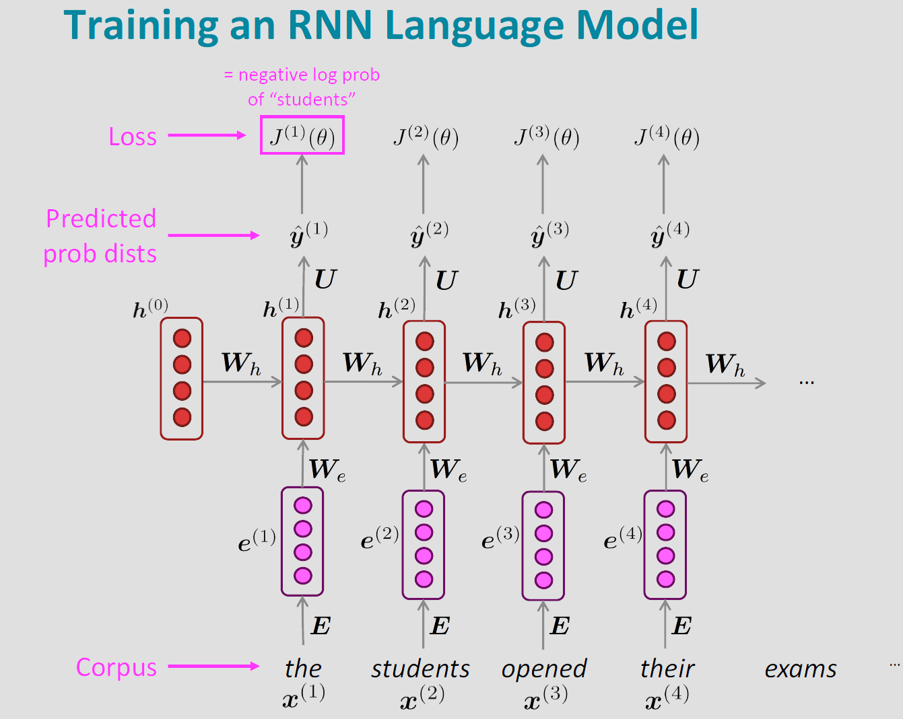
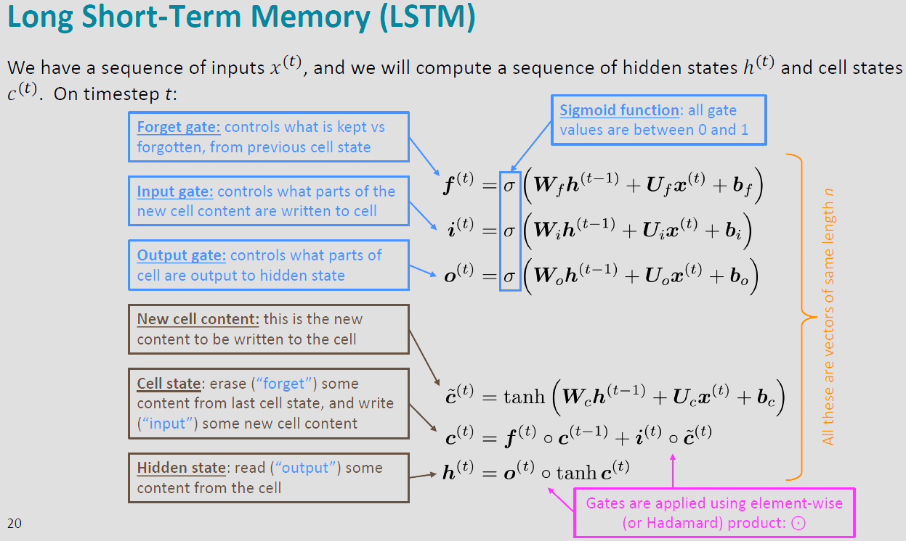
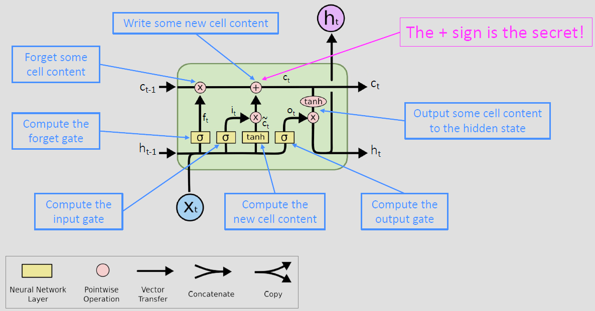
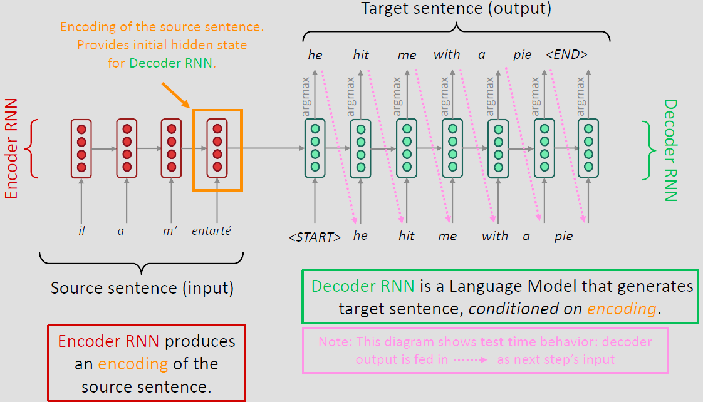

# CS224N: Natural Language Processing with Deep Learning

[Course Homepage](https://web.stanford.edu/class/archive/cs/cs224n/cs224n.1234/) [[course videos]](https://www.youtube.com/watch?v=rmVRLeJRkl4&list=PLoROMvodv4rOSH4v6133s9LFPRHjEmbmJ)

**Scope**

- The foundations of the effective modern methods for deep learning applied to NLP
  - Basics first, then key methods used in NLP in 2023: `Word vectors`, `feed-forward networks`, `recurrent networks`, `attention`, `encoder-decoder models`, `transformers`, `large pre-trained language models`, etc.
- A big picture understanding of human languages and the difficulties in understanding and producing them via computers
- An understanding of and **ability to build systems** (in Pytorch) for some of the major problems in NLP
  - Word meaning, dependency parsing, machine translation, question answering

 

**A few uses of NLP**

- *Machine Translation*.  
  - Perhaps one of the earliest and most successful applications and driving uses of natural language processing.
- *Question answering and information retrieval*.  
  - In NLP, question answering has tended to be related to information-seeking questions. 
- *Summarization and analysis of text*.  
  - There are myriad reasons to want to understand (1) what people are talking about and (2) what they think about those things. 
- *speech(or sign)-to-text*.  
  - The process of automatic transcription of spoken or signed language (audio or video) to textual representations is a massive and useful application.

 

**High-Level Plan for Assignments**

- Ass1 is hopefully an easy on ramp - A Jupyter/IPython Notebook
- Ass2 is pure Python (numpy) but expects you to do (multivariate) calculus, so you really understand the basics
- Ass3 introduces PyTorch, building a feed-forward network for dependency parsing
- Ass4 and Ass5 use PyTorch on a GPU (Microsoft Azure)
- For Final Project
  - Do the default project, which is a question answering system
  - Propose a custom final project

  

Lecture | Topics | Course Materials | Assignments |
| --------- | --------- | --------- | --------- |
| **Lecture 1** | **Word Vectors**   [[slides]](https://web.stanford.edu/class/archive/cs/cs224n/cs224n.1234/slides/cs224n-2023-lecture01-wordvecs1.pdf) [[notes]](https://web.stanford.edu/class/archive/cs/cs224n/cs224n.1234/readings/cs224n_winter2023_lecture1_notes_draft.pdf)      **Gensim word vectors**   [[code]](https://web.stanford.edu/class/archive/cs/cs224n/cs224n.1234/materials/Gensim%20word%20vector%20visualization.html) | Suggested Readings:   1. [Efficient Estimation of Word Representations in Vector Space](http://arxiv.org/pdf/1301.3781.pdf) (original word2vec paper)   2. [Distributed Representations of Words and Phrases and their Compositionality](http://papers.nips.cc/paper/5021-distributed-representations-of-words-and-phrases-and-their-compositionality.pdf) (negative sampling paper) | Assignment 1   [[code]](./assignments/assignment1) |
| **Lecture 2** | **Word Vectors, Word Window CLassification, Language Models**   [[slides]](https://web.stanford.edu/class/archive/cs/cs224n/cs224n.1234/slides/cs224n-2023-lecture02-wordvecs2.pdf) [[notes]](https://web.stanford.edu/class/archive/cs/cs224n/cs224n.1234/readings/cs224n-2019-notes02-wordvecs2.pdf)  | Suggested Readings:   1. [GloVe: Global Vectors for Word Representation](http://nlp.stanford.edu/pubs/glove.pdf) (original GloVe paper)   2. [Improving Distributional Similarity with Lessons Learned from Word Embeddings](http://www.aclweb.org/anthology/Q15-1016)   3. [Evaluation methods for unsupervised word embeddings](http://www.aclweb.org/anthology/D15-1036)    Additional Readings:   1. [A Latent Variable Model Approach to PMI-based Word Embeddings](http://aclweb.org/anthology/Q16-1028)   2. [Linear Algebraic Structure of Word Senses, with Applications to Polysemy](https://transacl.org/ojs/index.php/tacl/article/viewFile/1346/320)   [On the Dimensionality of Word Embedding](https://papers.nips.cc/paper/7368-on-the-dimensionality-of-word-embedding.pdf)  |  |
| **Lecture 3** | **Backprop and Neural Networks**   [[slides]](https://web.stanford.edu/class/archive/cs/cs224n/cs224n.1234/slides/cs224n-2023-lecture03-neuralnets.pdf) [[notes]](https://web.stanford.edu/class/archive/cs/cs224n/cs224n.1234/readings/cs224n-2019-notes03-neuralnets.pdf) | Suggested Readings:   1. [matrix calculus notes](https://web.stanford.edu/class/archive/cs/cs224n/cs224n.1234/readings/gradient-notes.pdf)   2. [Review of differential calculus](https://web.stanford.edu/class/archive/cs/cs224n/cs224n.1234/readings/review-differential-calculus.pdf)   3. [CS231n notes on network architectures](http://cs231n.github.io/neural-networks-1/) :thumbsup:   4. [CS231n notes on backprop](http://cs231n.github.io/optimization-2/) :thumbsup:   5. [Derivatives, Backpropagation, and Vectorization](http://cs231n.stanford.edu/handouts/derivatives.pdf)   6. [Learning Representations by Backpropagating Errors](http://www.iro.umontreal.ca/~vincentp/ift3395/lectures/backprop_old.pdf) (seminal Rumelhart et al. backpropagation paper)    Additional Readings:   1. [Yes you should understand backprop](https://medium.com/@karpathy/yes-you-should-understand-backprop-e2f06eab496b)   2. [Natural Language Processing (Almost) from Scratch](http://www.jmlr.org/papers/volume12/collobert11a/collobert11a.pdf) | Assignment 2   [[code]](./assignments/assignment2/) [[handout]](./assignments/assignment2/assignment2.pdf) |
| **Lecture 4** | **Dependency Parsing**   [[slides](https://web.stanford.edu/class/archive/cs/cs224n/cs224n.1234/slides/cs224n-2023-lecture04-dep-parsing.pdf)] [[notes]](https://web.stanford.edu/class/archive/cs/cs224n/cs224n.1234/readings/cs224n-2019-notes04-dependencyparsing.pdf)   [[slides (annotated)]](https://web.stanford.edu/class/archive/cs/cs224n/cs224n.1234/slides/cs224n-2021-lecture04-dep-parsing-annotated.pdf) | Suggested Readings:   1. [Incrementality in Deterministic Dependency Parsing](https://www.aclweb.org/anthology/W/W04/W04-0308.pdf)   2. [A Fast and Accurate Dependency Parser using Neural Networks](https://www.emnlp2014.org/papers/pdf/EMNLP2014082.pdf)   3. [Dependency Parsing](http://www.morganclaypool.com/doi/abs/10.2200/S00169ED1V01Y200901HLT002)   4. [Globally Normalized Transition-Based Neural Networks](https://arxiv.org/pdf/1603.06042.pdf)   5. [Universal Stanford Dependencies: A cross-linguistic typology](http://nlp.stanford.edu/~manning/papers/USD_LREC14_UD_revision.pdf)   6. [Universal Dependencies website](http://universaldependencies.org/)   7. [Jurafsky & Martin Chapter 14](https://web.stanford.edu/~jurafsky/slp3/14.pdf)|  | 
| **Lecture 5** | **Recurrent Neural Networks and Language Models**   [[slides]](https://web.stanford.edu/class/archive/cs/cs224n/cs224n.1234/slides/cs224n-2023-lecture05-rnnlm.pdf) [[notes]](https://web.stanford.edu/class/archive/cs/cs224n/cs224n.1234/readings/cs224n-2019-notes05-LM_RNN.pdf) | Suggested Readings:   1. [N-gram Language Models](https://web.stanford.edu/~jurafsky/slp3/3.pdf) (textbook chapter)   2. [The Unreasonable Effectiveness of Recurrent Neural Networks](http://karpathy.github.io/2015/05/21/rnn-effectiveness/) (blog post overview)   3. [Sequence Modeling: Recurrent and Recursive Neural Nets](http://www.deeplearningbook.org/contents/rnn.html) (Sections 10.1 and 10.2)   4. [On Chomsky and the Two Cultures of Statistical Learning](http://norvig.com/chomsky.html)   5. [Sequence Modeling: Recurrent and Recursive Neural Nets](http://www.deeplearningbook.org/contents/rnn.html) (Sections 10.3, 10.5, 10.7-10.12)    6. [Learning long-term dependencies with gradient descent is difficult](http://ai.dinfo.unifi.it/paolo//ps/tnn-94-gradient.pdf) (one of the original vanishing gradient papers)   7. [On the difficulty of training Recurrent Neural Networks](https://arxiv.org/pdf/1211.5063.pdf)(proof of vanishing gradient problem)   8. [Vanishing Gradients Jupyter Notebook](https://web.stanford.edu/class/archive/cs/cs224n/cs224n.1174/lectures/vanishing_grad_example.html) (demo for feedforward networks)   9. [Understanding LSTM Networks](http://colah.github.io/posts/2015-08-Understanding-LSTMs/) (blog post overview) | Assignment 3   [[code]](./assignments/assignment3/) [[handout]](./assignments/assignment3/a3_handout.pdf) |
| **Lecture 6** | **Seq2Seq, MT, Subword Models**   [[slides]](https://web.stanford.edu/class/archive/cs/cs224n/cs224n.1234/slides/cs224n-2023-lecture06-fancy-rnn.pdf) [[notes]](https://web.stanford.edu/class/archive/cs/cs224n/cs224n.1234/readings/cs224n-2019-notes05-LM_RNN.pdf) | Suggested Readings:   1. [Statistical Machine Translation Slides, CS224n 2015](https://web.stanford.edu/class/archive/cs/cs224n/cs224n.1162/syllabus.shtml) (lectures 2/3/4)   2. [Statistical Machine Translation](https://www.cambridge.org/core/books/statistical-machine-translation/94EADF9F680558E13BE759997553CDE5) (book by Philipp Koehn)   3. [BLEU](https://www.aclweb.org/anthology/P02-1040.pdf) (original paper)   4. [Sequence to Sequence Learning with Neural Networks](https://arxiv.org/pdf/1409.3215.pdf) (original seq2seq NMT paper)   5. [Sequence Transduction with Recurrent Neural Networks](https://arxiv.org/pdf/1211.3711.pdf) (early seq2seq speech recognition paper)   6. [Neural Machine Translation by Jointly Learning to Align and Translate](https://arxiv.org/pdf/1409.0473.pdf) (original seq2seq+attention paper)   7. [Attention and Augmented Recurrent Neural Networks](https://distill.pub/2016/augmented-rnns/) (blog post overview)   8. [Massive Exploration of Neural Machine Translation Architectures](https://arxiv.org/pdf/1703.03906.pdf) (practical advice for hyperparameter choices)   9. [Achieving Open Vocabulary Neural Machine Translation with Hybrid Word-Character Models](https://arxiv.org/abs/1604.00788.pdf)   10. [Revisiting Character-Based Neural Machine Translation with Capacity and Compression](https://arxiv.org/pdf/1808.09943.pdf)   11. [From vanilla RNNs to Transformers: a history of seq2seq learning](https://github.com/christianversloot/machine-learning-articles/blob/main/from-vanilla-rnns-to-transformers-a-history-of-seq2seq-learning.md) :thumbsup: | |
| **Lecture 7** | **Final Projects: Custom and Default; Practical Tips**   [[slides]](https://web.stanford.edu/class/archive/cs/cs224n/cs224n.1234/slides/cs224n-2023-lecture07-final-project.pdf) [[notes]](https://web.stanford.edu/class/archive/cs/cs224n/cs224n.1234/readings/cs224n-2019-notes06-NMT_seq2seq_attention.pdf) | Suggested Readings:   1. [Practical Methodology](https://www.deeplearningbook.org/contents/guidelines.html) (Deep Learning book chapter) | Assignment 4   [[code]](./assignments/assignment4/) [[handout]](https://web.stanford.edu/class/archive/cs/cs224n/cs224n.1234/assignments/a4.pdf)|
| **Lecture 8** | **Self-Attention and Transformers**   [[slides]](https://web.stanford.edu/class/archive/cs/cs224n/cs224n.1234/slides/cs224n-2023-lecture08-transformers.pdf) [[notes]](https://web.stanford.edu/class/archive/cs/cs224n/cs224n.1234/readings/cs224n-self-attention-transformers-2023_draft.pdf) | Suggested Readings:   1. [Default Project Handout](http://web.stanford.edu/class/cs224n/project/default-final-project-bert-handout.pdf)   2. [Attention Is All You Need](https://arxiv.org/abs/1706.03762.pdf)   3. [The Illustrated Transformer](https://jalammar.github.io/illustrated-transformer/)   4. [Transformer (Google AI blog post)](https://ai.googleblog.com/2017/08/transformer-novel-neural-network.html)   5. [Layer Normalization](https://arxiv.org/pdf/1607.06450.pdf)   6. [Image Transformer](https://arxiv.org/pdf/1802.05751.pdf)   7. [Music Transformer: Generating music with long-term structure](https://arxiv.org/pdf/1809.04281.pdf)  | Project Proposal   [[instructions]](https://web.stanford.edu/class/archive/cs/cs224n/cs224n.1234/project/project-proposal-instructions-2023.pdf)    Default Final Project   [[handout]](https://web.stanford.edu/class/archive/cs/cs224n/cs224n.1234/project/default-final-project-bert-handout.pdf) |
| **Lecture 9** | **Pretraining**   [[slides]](https://web.stanford.edu/class/archive/cs/cs224n/cs224n.1234/slides/cs224n-2023-lecture9-pretraining.pdf) | Suggested Readings:   1. [BERT: Pre-training of Deep Bidirectional Transformers for Language Understanding](https://arxiv.org/pdf/1810.04805.pdf)   2. [Contextual Word Representations: A Contextual Introduction](https://arxiv.org/abs/1902.06006.pdf)   3. [The Illustrated BERT, ELMo, and co.](http://jalammar.github.io/illustrated-bert/)   4. [Martin & Jurafsky Chapter on Transfer Learning](https://web.stanford.edu/~jurafsky/slp3/11.pdf)  | |
| **Lecture 10** | **Natural Language Generation**   [[slides]](https://web.stanford.edu/class/archive/cs/cs224n/cs224n.1234/slides/cs224n-2023-lecture10-nlg.pdf) | Suggested Readings:   1. [The Curious Case of Neural Text Degeneration](https://arxiv.org/abs/1904.09751.pdf)   2. [Get To The Point: Summarization with Pointer-Generator Networks](https://arxiv.org/abs/1704.04368.pdf)   3. [Hierarchical Neural Story Generation](https://arxiv.org/abs/1805.04833.pdf)   4. [How NOT To Evaluate Your Dialogue System](https://arxiv.org/abs/1603.08023.pdf) | Assignment 5   [[code]](https://web.stanford.edu/class/archive/cs/cs224n/cs224n.1234/assignments/a5.zip) [[handout]](https://web.stanford.edu/class/archive/cs/cs224n/cs224n.1234/assignments/a5.pdf) |
| **Lecture 11** | **Prompting, Reinforcement Learning from Human Feedback**   [[slides]](https://web.stanford.edu/class/archive/cs/cs224n/cs224n.1234/slides/cs224n-2023-lecture11-prompting-rlhf.pdf)  | Suggested Readings:   1. [Language Models are Few-Shot Learners](https://arxiv.org/abs/2005.14165)   2. [Chain-of-Thought Prompting Elicits Reasoning in Large Language Models](https://arxiv.org/abs/2201.11903)   3. [Finetuned Language Models Are Zero-Shot Learners](https://arxiv.org/abs/2109.01652)   4. [Learning to summarize from human feedback](https://arxiv.org/abs/2009.01325) | |
| **Lecture 12** | **Question Answering**   [[slides]](https://web.stanford.edu/class/archive/cs/cs224n/cs224n.1234/slides/cs224n-2023-lecture12-QA.pdf) | Suggested Readings:   1. [SQuAD: 100,000+ Questions for Machine Comprehension of Text](https://arxiv.org/pdf/1606.05250.pdf)   2. [Bidirectional Attention Flow for Machine Comprehension](https://arxiv.org/pdf/1611.01603.pdf)   3. [Reading Wikipedia to Answer Open-Domain Questions](https://arxiv.org/pdf/1704.00051.pdf)   4. [Latent Retrieval for Weakly Supervised Open Domain Question Answering](https://arxiv.org/pdf/1906.00300.pdf)   5. [Dense Passage Retrieval for Open-Domain Question Answering](https://arxiv.org/pdf/2004.04906.pdf)   6. [Learning Dense Representations of Phrases at Scale](https://arxiv.org/pdf/2012.12624.pdf) | Project Milestone   [[Instructions]](https://web.stanford.edu/class/archive/cs/cs224n/cs224n.1234/project/CS224N_Final_Project_Milestone_Instructions.pdf) |
| **Lecture 13** | **ConvNets, Tree Recursive Neural Networks and Constituency Parsing**   [[slides]](https://web.stanford.edu/class/archive/cs/cs224n/cs224n.1234/slides/cs224n-2023-lecture13-CNN-TreeRNN.pdf) | Suggested Readings:   1. [Convolutional Neural Networks for Sentence Classification](https://arxiv.org/abs/1408.5882.pdf)   2. [Improving neural networks by preventing co-adaptation of feature detectors](https://arxiv.org/abs/1207.0580)   3. [A Convolutional Neural Network for Modelling Sentences](https://arxiv.org/pdf/1404.2188.pdf)   4. [Parsing with Compositional Vector Grammars](http://www.aclweb.org/anthology/P13-1045)   5. [Constituency Parsing with a Self-Attentive Encoder](https://arxiv.org/pdf/1805.01052.pdf)| |
| **Lecture 14** | **Insights between NLP and Linguistics (by Isabel Papadimitriou)**   [[slides]](https://web.stanford.edu/class/archive/cs/cs224n/cs224n.1234/slides/cs224n-2023-lecture14-insights-linguistics.pdf) | | |
| **Lecture 15** | **Code Generation (by Gabriel Poesia)**   [[slides]](https://web.stanford.edu/class/archive/cs/cs224n/cs224n.1234/slides/cs224n-2023-lecture15-code-generation.pdf) | Suggested Readings:   1. [Program Synthesis with Large Language Models](https://arxiv.org/pdf/2108.07732.pdf)   2. [Competition-level code generation with AlphaCode](https://www.science.org/doi/full/10.1126/science.abq1158)   3. [Evaluating Large Language Models Trained on Code](https://arxiv.org/abs/2107.03374) ||
| **Lecture 16** | **Multimodal Deep Learning (by Douwe Kiela)**   [[slides]](https://web.stanford.edu/class/archive/cs/cs224n/cs224n.1234/slides/Multimodal-Deep-Learning-CS224n-Kiela.pdf) | | |
| **Lecture 17** | **Coreference Resolution**   [[slides]](https://web.stanford.edu/class/archive/cs/cs224n/cs224n.1234/slides/cs224n-2023-lecture17-coref.pdf) | Suggested Readings:   1. [Coreference Resolution Chapter from Jurafsky and Martin](https://web.stanford.edu/~jurafsky/slp3/21.pdf)   2. [End-to-end Neural Coreference Resolution](https://arxiv.org/pdf/1707.07045.pdf) | |
| **Lecture 18** | **Analysis and Interpretability Basics (by John Hewitt)**   [[slides]](https://web.stanford.edu/class/archive/cs/cs224n/cs224n.1234/slides/cs224n-2023-lecture18-analysis.pdf) | | |
| **Lecture 19** | **Model Interpretability and Editing (by Been Kim)**   [[slides]](https://web.stanford.edu/class/archive/cs/cs224n/cs224n.1234/slides/Been-Kim-StanfordLectureMarch2023.pdf) | | |

 

## Lecture 1: Introduction and Word Vectors

### Representating words by their context

- **Distributional semantics**: A word's meaning is given by the words that frequently appear close-by

## Word Vectors

We will build a dense vector for each word, chosen so that it is aimilar to vectors of words that appear in similar contexts.

> `word vectors` are also called `word embeddings` or `word representations`. They are a `distributed` representations.

## Word2vec

`Word2vec` (Mikolov et al. 2013) is a framework for learning word vectors.

### Idea

- We have a large corpus ("body") of text
- Every word in a fixed vocabulary is represented by a `vector`
- Go through each position `t` in the text, which as a center word `c` and context ("outside") word `o`
- Use the `simiilarity of the word vectors` for `c` and `o` to `calculate the probabilty` of `o` given `c` (or vice versa)
- `Keep adjusting the word vectors` to maximize this probability

## Lecture 2: Word Vectors, Word Senses, and Neural Network Classifiers

Two model variants:

1. **Skip-gram (SG)**
   Predict context ("outside") words (position independent) given center word
2. **Continuous Bas of Words (CBOW)**
   Predict center word from (bag of) context words

Additional efficiency in training: **Negative sampling**

## Lecture 3: Backpropagation

## Lecture 4: Syntactic Structure and Dependency Parsing

Dependency syntax postulates that syntactic structure consists of relations between lexical items, normally binary asymmetric relations called `dependencies`. An arrow connects a `head` (governor, superior, regent) with a `dependent` (modifier, inferior, subordinate). Usually, dependencies form a tree (a connected, acyclic, single-root graph).

### Dependency Parsing

A sentence is parsed by choosing for each word what other word (including ROOT) it is a dependent of.

Usually some constructs:
- Only one word is a dependent of ROOT
- Don't want cycles A->B, B->A

Final issue is whether arrows can cross (be non-projective) or not.

### Methods of Dependency Parsing

1. Dynamic programming
2. Graph algorithms
3. Constraint Satisfaction
4. Transition-based parsing or deterministic dependency parsing

### Dependency Parsing Evaluations

- UAS (Unlabeled attachment score): `head`
- LAS (Labeled attachment score): `head and label`

### A neural dependency parse [Chen and Manning 2014]

- **[First Win]**: Distributed Representations
  - Represent each word as a `d`-dimensional dense vector (i.e., word embedding)
  - Meanwhile, `part-of-speach tags (POS)` and `dependency labels` are also represented as `d`-dimensional vectors.
-  **[Second win]**: Deep learning classifiers are non-linear classifiers
   -  A `softmax classifier` assigns classes $y \in C$ based on inputs $x \in \mathbb{R}^d$ via the probability: $p(y|x)=\frac{exp(w_yx)}{\sum exp(w_cx)}$. We train the weight matrix $W \in \mathbb{R}^{c\times d}$ to minimize the neg.log loss: $\sum_i{-logp(y_i|x_i)}$
   -  Traditional ML classifiers (including Na$\dot{i}$ve Bayes, SVMs, logistic regression and softmax classifier) are not very powerful classifiers, they only give linear decision boundaries.
   -  Neural networks can learn much more complex functions with nonlinear decision boundaries.

Further developments in transition-based neural dependency parser: [The World's Most Accurate Parser](https://blog.research.google/2016/05/announcing-syntaxnet-worlds-most.html)

## Lecture 5: Language Models and Recurrent Neural Networks

### Language Modeling

Language modeling is the task of predicting what word comes next. More formally, given a sequence of words $x^{(1)},xT{(2)},...,x^{(t)}$, compute the probability distribution of the next word $x^{(t+1)}$: $P(x^{(t+1)|x^{(t),...,x^{(1)}}})$, where $x^{(t+1)}$ can be any word in the vocabulary $V={w_1,...,w_{|V|}}$.

#### N-gram Language Models

- Definition: An `n-gram` is a chunk of n consecutive words.
- Idea: Collect statistics about how frequent different n-grams are and use these to predict next word.
- **Markov Assumption**: $x^{(t+1)}$ depends only on the preceding `n-1` words.
  - $P(x^{(t+1)}|x^{(t)},...,x^{(1)})=P(x^{(t+1)|x^{(t)},...,x^{(t-n+2)}})$
  - Question: How do we get these `n-gram` and `(n-1)-gram` probabilities?
  - Answer: By counting them in some large corpus of text, which is statistical approximation.
    - $\approx \frac{count(x^{(t+1),x^{(t),...x^{(t-n+2)}}})}{count(x^{(t),...,x^{(t-n+2)}})}$
- Sparsity Problems (take 4-grams as an example)
  - n-gram `~ ~ ~ w` never occur: add small $\delta$ to the count for every $w\in V$. This is called `smoothing`.
  - n-gram `~ ~ ~` never occur: Just condition on `~ ~` instead. This is called `backoff`.
  - Increasing `n` makes sparsity problems worse. Typically, we can't have n bigger than 5.
- Storage Problems
  - Need to store count for all n-grams you saw in the corpus.
- [Y.Bengio, et.al: A Neural Probabilistic Language Model](https://www.jmlr.org/papers/volume3/bengio03a/bengio03a.pdf)
  - Fixed window is too small.
  - $X^{(1)}$ and $x^{(2)}$ are multiplied by completely different weights in $W. No symmetry in how the inputs are processed.

#### Recurrent Neural Networks (RNN)

- Idea: Apply the same weights $W$ repeatedly.
- A Simple RNN Language Model
  - hidden states: $h^{(t)}=\sigma(W_hh^{(t-1)}+W_ee^{(t)}+b_1)$, where $h^{(0)}$ is the initial hidden state.
- RNN Advantages:
  - Can process any length input
  - Computation for step *t* can (in theory) use information from many steps back
  - Model size doesn't increase for longer input context
  - Same weights applied on every timestep, so there is symmetry in how inputs are processed.
- RNN Disadvantages:
  - Recurrent computation is slow.
  - In practice, difficult to access information from many steps back.
- Train an RNN Language Model
  - Feed `a big corpus of text` into RNN-LM, compute output distribution $\hat{y}^{(t)}$ for `every step t`.
  - `Loss function` on step t is `cross-entropy` between predicted probability distribution $\hat{y}^{(t)}$, and the true next word $y^{(t)}$ (one-hot for $x^{(t+1)}$): $J^{(t)}_{(\theta)}=CE(y^{(t)},\hat{y}^{(t)})=-\sum\limits_{w\in V}y_w^{(t)}log\hat{y}_w^{(t)}=-log\hat{y}_{x_{t+1}}^{(t)}$
  - Average this above loss to get `overall loss` for entire training set: $J(\theta)=\frac{1}{T}\sum\limits_{t=1}^T J^{(t)}(\theta)=\frac{1}{T}\sum\limits_{t=1}^{T}-log\hat{y}_{x_{t+1}}^{(t)}$
  - Computing loss and gradients across `entire corpus` $x^{(1)},...,x^{(T)}$ at once is `too expensive` (memory-wise)!
  - Recall **SGD (Stochastic Gradient Descent)**: compute loss $J(\theta)$ for a batch of sentences, compute gradients and update weights. 

 

#### Evaluating Language Models

- The standard `evaluation metric` for language models is `perplexity`.
- perplexity=$\prod\limits_{t=1}^{T}(\frac{1}{P_{LM}(x^{(t+1)}|x^{(t),...,x^{(1)}})})^{1/T}$
- This is equal to the exponential of the cross-entropy loss $J(\theta)=\prod\limits_{t=1}^{T}(\frac{1}{\hat{y_{x_{t+1}}^{(t)}}})^{1/T}=exp(\frac{1}{T}\sum\limits_{t=1}^{T}-log\hat{y}_{x_{(t=1)}^{(t)}})=exp(J(\theta))$
- Lower perplexity is better!

#### Problems with RNNs

- **Vanishing gradient problem**
  - Model weights are updated only with respect to near effects, not long-term effects.
  - Solution
    - How about an RNN with separate memory which is added to? `LSTMS`
    - Creating more direct and linear pass-through connections in model: `Attention`, `residual connections`, etc.
- **Exploding gradient problem**
  - If the gradient becomes too big, then the SGD update step becomes too big.
  - Solution:
    - `Gradient clipping`: if the norm of the gradient is greater than some threshold, scale it down before applying SGD update. 
      - `Intuition`: take a step in the same direction, but a smaller step.
  - In practice, rembering to clip gradients is important, but exploding gradients are an easy problem to solve.

#### Other RNN uses

- sequence tagging
  - part-of-speech tagging
  - named entity recognition
- sentence classification
  - sentiment classification
- as an encoder module
  - question answering, machine translation
- generate text
  - speech recognition, machine translation, summarization

## Lecture 6: LSTM RNNs and Neural Machine Translation

#### Long Short-Term Memory RNNs (LSTMs)

- a solution to the problem of `vanishing gradients`, became well-known after Hinton brought it to Google in 2013.
  - Long short-term memory [[Hochreiter and Schmidhuber, 1997]](https://www.bioinf.jku.at/publications/older/2604.pdf)
  - Learning to Forget: Continual Prediction with LSTM. [[Gers, 2000]](https://dl.acm.org/doi/10.1162/089976600300015015)
  - Connectionist temporal classification: Labelling unsegmented sequence data with recurrent neural nets. [[Graves, 2006]](https://www.cs.toronto.edu/~graves/icml_2006.pdf)
- Idea
  - on step $t$, there is a `hidden state` $h^{(t)}$ and a `cell state` $c^{(t)}$
    - Both are vectors length $n$
    - The cell stores `long-term information`
    - The LSTM can `read`, `erase`, and `write` information from the cell
  - The selection of which information is erased/written/read is controlled by three corresponding `gates`
    - The gates are also vectors of length $n$
    - On each timestep, each element of the gates can be `open(1)`, `closed(0)`, or somewhere in-between
    - The gates are `dynamic`: their value is computed based on the current context
- How does LSTM solve vanishing gradients?
  - The LSTM architecture makes it much easier for an RNN to `preserve information over many timesteps`
  - In practice, you get about 100 timesteps rather than about 7
  

> Is vanishing/exploding gradient just an RNN problem?

- No! It can be a problem for all neural architectures (including `feed-forward` and `convolutional`), especially `very deep` ones.
- Another solution: lots of new deep feedforward/convolutional architectures `add direct connections`
  - `Residual connections` aka "ResNet" [[Deep Residual Learning for Image Recognition]](https://arxiv.org/pdf/1512.03385.pdf)
    - Also known as `skip-connections`
    - The `identity connection preserves information` by default
    - This makes `deep` networks much `easier to train`
  - `Dense connections` aka "DenseNet" [[Densely Connected Convolutional Networks]](https://arxiv.org/pdf/1608.06993.pdf)
    - `Highway connections` aka "HighwayNet" [[Highway Networks]](https://arxiv.org/pdf/1505.00387.pdf)
- Conclusion: Through vanishing/exploding gradients are a general problem, `RNNs are particularly unstable` due to the repeated multiplication by the `same` weight matrix. [[Learning Long-Term Dependencies with Gradient Descent is Difficult, Bengio et al. 1994]](http://ai.dinfo.unifi.it/paolo//ps/tnn-94-gradient.pdf)

#### Bidirectional and Multi-layer RNNs

- On timestep $t$
  - Forward RNN $\overrightarrow{h}^{(t)}=RNN_{FW}(\overrightarrow{h}^{(t-1)}), x^{(t)})$
  - Backward RNN $\overleftarrow{h}^{(t)}=RNN_{BW}(\overleftarrow{h}^{(t+1)}, x^{(t)})$
  - Generally, these twoo RNNs have separate weights
  - the hidden state of a `Bidirectional RNN`: $h^{(t)}=[\overrightarrow{h}^{(t)};\overleftarrow{h}^{(t)}]$
- Bidirectional RNNs are only applicable if you have access to the `entire input sequence`, so they are not applicable to Language Modeling
- If you do have entire input sequence, `bidirectionality is powerful` (you should use it by default).
- For example, `BERT` (Bidirectional Encoder Representations from Transformers) is a powerful pretrained contextual representation system `built on bidirectionality`.

#### Multi-layer RNNs

- Multi-layer RNNs are also called `stacked RNNs`.
- `High-performing RNNs are usually multi-layer`. `2 to 4 layers` is best for the encoder RNN, and `4 layers` is best for the decoder RNN.
- Usually, `skip-connections`/`dense-connections` are needed to train deeper RNNs (e.g., `8 layers`).
- `Transformer`-based networks (e.g., BERT) are usually deeper, like `12 or 24 layers`.

#### Machine Translation

- **Machine Translation (MT)** is the task of translating a sentence x from one language (the source language) to a sentence y in another language (the target language).
- **Statistical Machine Translation** (1990s-2010s)
  - Learn a `probabilistic model` from data
  - Find `best English sentence` y, given `French sentence` x: $argmax_y P(y|x)$
  - Use Bayes Rule to break this down into two components to be learned separately $argmax_yP(x|y)P(y)$
  - Lots of `feature engineering`
- **Neural Machine Translation (NMT)**
  - Machine Translation with a `single end-to-end neural network`
  - The neural network architecture is called a `sequence-to-sequence` model (aka `seq2seq`) and it involves `two RNNs`.
  - The general notion here is an `encoder-decoder` model
  - Sequence-to-sequence is useful for `more than just MT`
  - Many NLP tasks can be phrased as sequence-to-sequence
    - `Summarization` (long text $\rightarrow$ short text)
    - `Dialogue` (previous utterances $\rightarrow$ next utterance)
    - `Parsing` (input text $\rightarrow$ output parse as sequence)
    - `Code generation` (natural language $\rightarrow$ code)
  - NMT directly calculates $P(y|x)$: $P(y|x)=P(y_1|x)P(y_2|y_1,x)...P(y_T|y_1,...,y_{T-1},x)$
- **Machine Translation Evaluation**
  - [BLEU (Bilingual Evaluation Understudy)](http://aclweb.org/anthology/P02-1040)
    - BLEU compares the `machine-written translation` to one or several `human-written translation`, and computes a `similarity score` based on:
      - `n-gram precision`
      - Plus a penalty for too-short system translations
    - BLEU is useful but imperfect
      - a good translation can get a poor BLEU score because it has low n-gram overlap with the human translation

 