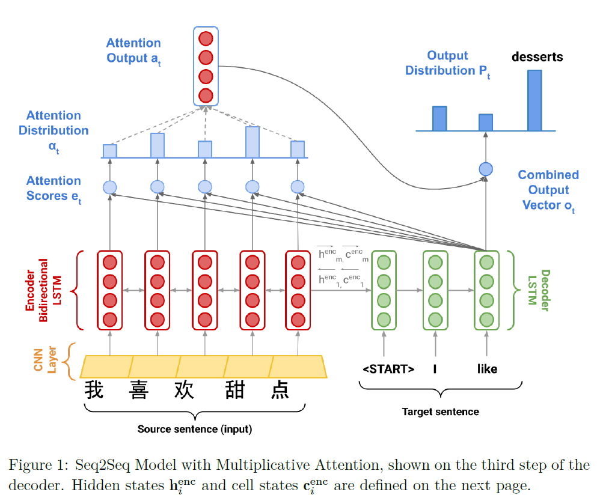

# CS224n Assignment #4: Neural Machine Translation 

> Note: Heavily inspired by the https://github.com/pcyin/pytorch_basic_nmt repository

This assignment is split into two sections: `Neural Machine Translation with RNNs` and `Analyzing NMT Systems`. The first is primarily coding and implementation focused, whereas the second entirely consists of written, analysis questions. Note that the NMT system is more complicated than the neural networks we have previously constructed within this class and takes about `2 hours to train on GPU`. 


## Neural Machine Translation with RNNS

In Machine Translation, our goal is to convert a sentence from the *source* language (e.g. Mandrain Chinese) to the *target* language (e.g. English). In this assignment, we will implement a sequence-to-sequence (Seq2Seq) network with attention, to build a Neural Machine Translation (NMT) system. In this section, we describe the **training procedure** for the proposed NMT system, which uses a Bidirectional LSTM Encoder and a Unidirectional LSTM Decoder.



### Implementation and written questions

1. (coding) In order to apply tensor operations, we must ensure that the sentences in a given batch are of the same length. Thus, we must identify the longest sentence in a batch and pad others to be the same length. Implement the `pad_sents` function in `utils.py`, which shall produce these padded sentences.

```python
def pad_sents(sents, pad_token):
    """ Pad list of sentences according to the longest sentence in the batch.
        The paddings should be at the end of each sentence.
    @param sents (list[list[str]]): list of sentences, where each sentence
                                    is represented as a list of words
    @param pad_token (str): padding token
    @returns sents_padded (list[list[str]]): list of sentences where sentences shorter
        than the max length sentence are padded out with the pad_token, such that
        each sentences in the batch now has equal length.
    """
    sents_padded = []

    ### YOUR CODE HERE (~6 Lines)
    max_len = max([len(s) for s in sents])
    sents_padded = [s + [pad_token] * (max_len-len(s)) for s in sents]
    ### END YOUR CODE

    return sents_padded
```

2. (coding) Implement the `__init__` function in `model_embeddings.py` to initialize the necessary source and target embeddings.

```python
class ModelEmbeddings(nn.Module): 
    """
    Class that converts input words to their embeddings.
    """
    def __init__(self, embed_size, vocab):
        """
        Init the Embedding layers.

        @param embed_size (int): Embedding size (dimensionality)
        @param vocab (Vocab): Vocabulary object containing src and tgt languages
                              See vocab.py for documentation.
        """
        super(ModelEmbeddings, self).__init__()
        self.embed_size = embed_size

        # default values
        self.source = None
        self.target = None

        src_pad_token_idx = vocab.src['<pad>']
        tgt_pad_token_idx = vocab.tgt['<pad>']

        ### YOUR CODE HERE (~2 Lines)
        ### TODO - Initialize the following variables:
        ###     self.source (Embedding Layer for source language)
        ###     self.target (Embedding Layer for target langauge)
        ###
        ### Note:
        ###     1. `vocab` object contains two vocabularies:
        ###            `vocab.src` for source
        ###            `vocab.tgt` for target
        ###     2. You can get the length of a specific vocabulary by running:
        ###             `len(vocab.<specific_vocabulary>)`
        ###     3. Remember to include the padding token for the specific vocabulary
        ###        when creating your Embedding.
        self.source = nn.Embedding(len(vocab.src), self.embed_size, src_pad_token_idx)
        self.target = nn.Embedding(len(vocab.tgt), self.embed_size, tgt_pad_token_idx)
        ### END YOUR CODE
```

3. (coding) Implement the `__init__` function in `nmt_model.py` to initialize the necessary model layers (LSTM, CNN, projection, and dropout) for the NMT system.

```python
class NMT(nn.Module):
    """ Simple Neural Machine Translation Model:
        - Bidrectional LSTM Encoder
        - Unidirection LSTM Decoder
        - Global Attention Model (Luong, et al. 2015)
    """

    def __init__(self, embed_size, hidden_size, vocab, dropout_rate=0.2):
        """ Init NMT Model.

        @param embed_size (int): Embedding size (dimensionality)
        @param hidden_size (int): Hidden Size, the size of hidden states (dimensionality)
        @param vocab (Vocab): Vocabulary object containing src and tgt languages
                              See vocab.py for documentation.
        @param dropout_rate (float): Dropout probability, for attention
        """
        super(NMT, self).__init__()
        self.model_embeddings = ModelEmbeddings(embed_size, vocab)
        self.hidden_size = hidden_size
        self.dropout_rate = dropout_rate
        self.vocab = vocab

        # default values
        self.encoder = None
        self.decoder = None
        self.h_projection = None
        self.c_projection = None
        self.att_projection = None
        self.combined_output_projection = None
        self.target_vocab_projection = None
        self.dropout = None
        # For sanity check only, not relevant to implementation
        self.gen_sanity_check = False
        self.counter = 0

        ### YOUR CODE HERE (~9 Lines)
        ### TODO - Initialize the following variables IN THIS ORDER:
        ###     self.post_embed_cnn (Conv1d layer with kernel size 2, input and output channels = embed_size,
        ###         padding = same to preserve output shape )
        ###     self.encoder (Bidirectional LSTM with bias)
        ###     self.decoder (LSTM Cell with bias)
        ###     self.h_projection (Linear Layer with no bias), called W_{h} in the PDF.
        ###     self.c_projection (Linear Layer with no bias), called W_{c} in the PDF.
        ###     self.att_projection (Linear Layer with no bias), called W_{attProj} in the PDF.
        ###     self.combined_output_projection (Linear Layer with no bias), called W_{u} in the PDF.
        ###     self.target_vocab_projection (Linear Layer with no bias), called W_{vocab} in the PDF.
        ###     self.dropout (Dropout Layer)
        self.post_embed_cnn = nn.Conv1d(embed_size, embed_size, 2)
        self.encoder = nn.LSTM(embed_size, hidden_size, bidirectional=True)
        self.decoder = nn.LSTMCell(embed_size, hidden_size)
        self.h_projection = nn.Linear(2 * hidden_size, hidden_size, bias=False)
        self.c_projection = nn.Linear(2 * hidden_size, hidden_size, bias=False)
        self.att_projection = nn.Linear(2 * hidden_size, hidden_size, bias=False)
        self.combined_output_projection = nn.Linear(3 * hidden_size, hidden_size, bias=False)
        self.target_vocab_projection = nn.Linear(hidden_size, len(vocab.tgt), bias=False)
        self.dropout = nn.Dropout(dropout_rate)
        ### END YOUR CODE
```

4. (coding) Implement the `encode` function in `nmt_model.py`. This function converts the padded source sentences into the tensor $\mathbf{X}$, generates $h_1^{enc}, ..., h_m^{enc}$, and computes the initial state $h_0^{dec}$ and initial cell $c_0^{dec}$ for the Decoder. YOu can run a non-comprehensive sanity check by executing: `python sanity_check.py 1d`

```python
def encode(self, source_padded: torch.Tensor, source_lengths: List[int]) -> Tuple[
        torch.Tensor, Tuple[torch.Tensor, torch.Tensor]]:
        """ Apply the encoder to source sentences to obtain encoder hidden states.
            Additionally, take the final states of the encoder and project them to obtain initial states for decoder.

        @param source_padded (Tensor): Tensor of padded source sentences with shape (src_len, b), where
                                        b = batch_size, src_len = maximum source sentence length. Note that
                                       these have already been sorted in order of longest to shortest sentence.
        @param source_lengths (List[int]): List of actual lengths for each of the source sentences in the batch
        @returns enc_hiddens (Tensor): Tensor of hidden units with shape (b, src_len, h*2), where
                                        b = batch size, src_len = maximum source sentence length, h = hidden size.
        @returns dec_init_state (tuple(Tensor, Tensor)): Tuple of tensors representing the decoder's initial
                                                hidden state and cell. Both tensors should have shape (2, b, h).
        """
        enc_hiddens, dec_init_state = None, None

        ### YOUR CODE HERE (~ 11 Lines)
        ### TODO:
        ###     1. Construct Tensor `X` of source sentences with shape (src_len, b, e) using the source model embeddings.
        ###         src_len = maximum source sentence length, b = batch size, e = embedding size. Note
        ###         that there is no initial hidden state or cell for the encoder.
        ###     2. Apply the post_embed_cnn layer. Before feeding X into the CNN, first use torch.permute to change the
        ###         shape of X to (b, e, src_len). After getting the output from the CNN, still stored in the X variable,
        ###         remember to use torch.permute again to revert X back to its original shape.
        ###     3. Compute `enc_hiddens`, `last_hidden`, `last_cell` by applying the encoder to `X`.
        ###         - Before you can apply the encoder, you need to apply the `pack_padded_sequence` function to X.
        ###         - After you apply the encoder, you need to apply the `pad_packed_sequence` function to enc_hiddens.
        ###         - Note that the shape of the tensor output returned by the encoder RNN is (src_len, b, h*2) and we want to
        ###           return a tensor of shape (b, src_len, h*2) as `enc_hiddens`, so you may need to do more permuting.
        ###         - Note on using pad_packed_sequence -> For batched inputs, you need to make sure that each of the
        ###           individual input examples has the same shape.
        ###     4. Compute `dec_init_state` = (init_decoder_hidden, init_decoder_cell):
        ###         - `init_decoder_hidden`:
        ###             `last_hidden` is a tensor shape (2, b, h). The first dimension corresponds to forwards and backwards.
        ###             Concatenate the forwards and backwards tensors to obtain a tensor shape (b, 2*h).
        ###             Apply the h_projection layer to this in order to compute init_decoder_hidden.
        ###             This is h_0^{dec} in the PDF. Here b = batch size, h = hidden size
        ###         - `init_decoder_cell`:
        ###             `last_cell` is a tensor shape (2, b, h). The first dimension corresponds to forwards and backwards.
        ###             Concatenate the forwards and backwards tensors to obtain a tensor shape (b, 2*h).
        ###             Apply the c_projection layer to this in order to compute init_decoder_cell.
        ###             This is c_0^{dec} in the PDF. Here b = batch size, h = hidden size


        ### END YOUR CODE
```

5. (coding) Implement the `decode` function in `nmt_model.py`. This function constructs $\bar{y}$ and runs the step function over every timestep for the input. You can run a non-comprehensive sanity check by executing: `python sanity_check.py 1e`
6. (coding) Implement the step function in `nmt_model.py`. This function applies the Decoder' LSTM cell for a single timestep, computing the encoding of the target subword $h_t^{dec}$, the attention score $e_t$, attention distribution $\alpha_t$, the attention output $a_t$, and finally the combined output $o_t$. You can run a non-comprehensive sanity check by executing: `python sanity_check.py 1f`
7. (written) The `generate_sent_masks()` function in `nmt_model.py` produces a tensor called `enc_masks`. It has shape (batch_size, max source sentence length) and contains 1s in positions corresponding to 'pad' tokens in the input, and 0s for non-pad tokens. Look at how the masks are used during the attention computation in the step() function (lines 311-312).
<br>
First explain (in around three sentences) what effect the masks have on the entire attention computation. Then explain (in one or two sentences) why it is necessary to use the masks in this way.

### Training

8. (written) In class, we learnt about dot product attention, multiplicative attention, and additive attention. As a reminder, dot product attention is $e_{t,i}=s_t^Th_i$ , and additive attention is $e_{t,i}=v^Ttanh(W_1h_i+W_2s_t)$.
    - Explain one advantage and one disadvantage of *dot product attention* compared to multiplicative attention.
    - Explain one advantage and one disadvantage of *additive attention* compared to multiplicative attention.