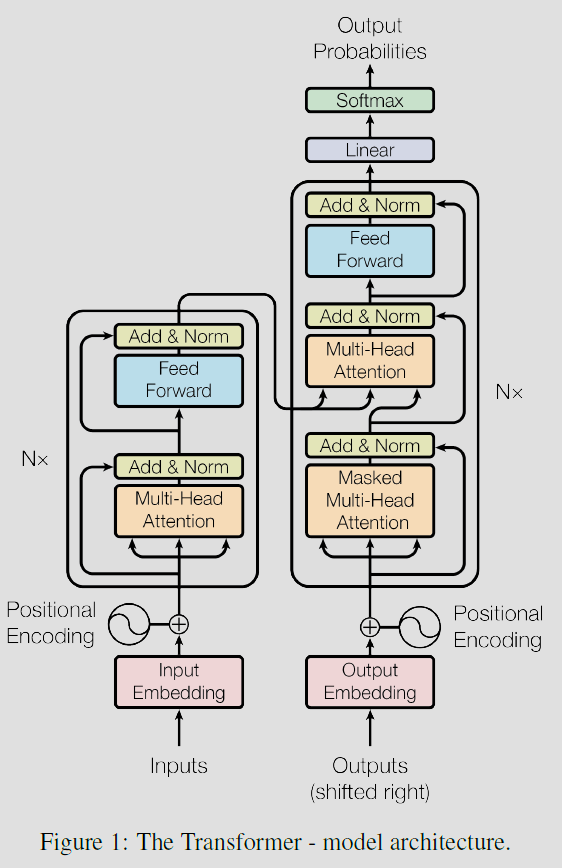

- [论文阅读](#论文阅读)
  - [Attention is All You Need 论文阅读](#attention-is-all-you-need-论文阅读)
    - [主要工作](#主要工作)
    - [模型架构](#模型架构)
      - [Attention 注意力](#attention-注意力)
        - [Scaled Dot-Product Attention](#scaled-dot-product-attention)
        - [Multi-head Attention 多头注意力](#multi-head-attention-多头注意力)
      - [Layer Norm](#layer-norm)
      - [Position-wise Feed-Forward Networks](#position-wise-feed-forward-networks)
      - [Embedding and Softmax](#embedding-and-softmax)
      - [Positional Encoding](#positional-encoding)
    - [实验设置](#实验设置)
      - [Optimizer 优化器](#optimizer-优化器)
      - [Regularization 正则化](#regularization-正则化)
    - [参考资料](#参考资料)

# 论文阅读
## Attention is All You Need 论文阅读

### 主要工作

- 更简单：提出仅采用注意力机制，而摒弃RNN卷积的Transformer架构
- 更高效：Transformer架构可以并行训练

### 模型架构

模型为Encoder-Decoder架构。

- Encoder：6个相同的模型块。
  - 每一块包含两个子层。
    - Multi-head self-attention
    - Position-wise fully conntected feed-forward network　
  - 对每一个子层，进行残差连接（residual connection），紧接着做layer normalization，即每一个子层的输出为`LayerNorm(x+Sublayer(x))`，每一层的输出维度$d_{model}=512$。
- Decoder：6个相同的模型块。
  - 每一块包含三个子层。
    - Masked Multi-head attention
    - Multi-head self-attention
    - Position-wise fully conntected feed-forward network
  - 每一个子层之后的残差连接和layer normalization与Encoder相同。　
- Encoder-Decoder：不再是自注意力（self-attention），queries来自decoder层，而keys和values来自encoder的输出。

#### Attention 注意力

注意力函数将一个query和一组key-value对映射到一个输出，最终的输出可以被看成是value的加权和，而权重则来自于query和相应key的相似度（compatibility function）。

##### Scaled Dot-Product Attention 

输入由相同维度$d_k$的queries和keys，和维度为$d_v$的values组成，通过计算query和所有keys的电机，再除以$\sqrt{d_k}$，接着通过一个softmax函数得到每个value的权重。

  $Attention(Q,K,V)=softmax(\frac{QK^{\intercal}}{\sqrt{d_k}})V$

##### Multi-head Attention 多头注意力 

由于一个attention函数只是value值的加权和，可学习的参数不多，因此引入多头注意力机制，模拟卷积神经网络多输出通道的效果。实现方法，是将queries，keys和values投影到低维的空间$h$次。每一个投影的输出合并到一起，再投影得到最终的输出。

  $MultiHead(Q,K,V)=Concat(head_1,...,head_h)W^O$, where $head_i=Attention(QW_i^Q,KW_i^K,VW_i^V)$

Transformer模型使用Multi-head attention的三种方法：
- 在encoder模块里，包含self-attention层，所有的keys，values和queries其实都来自于同一个来源，也就是上一层的输出。encoder中的每一个位置都可以和上一层的每一个位置进行计算。
- 在decoder模块里，自注意力机制和encoder一样。但为了防止提前看到当前位置后方的信息，采用mask来把后方位置的连接给屏蔽掉。

#### Layer Norm 

在序列模型里，每个样本的长度可能会不一样。对于这种情况，batch norm算出来的均值和方差抖动可能会比较大。另外，在预测时，全局的均值方差对于新遇到的样本可能不具备参考价值。Layer norm针对样本内部进行归一化不受样本长度影响。

#### Position-wise Feed-Forward Networks

除了attention模块，encoder和decoder里面还包含了一个全连接层。全连接层主要用于处理序列中的位置信息。

  $FFN(x)=max(0,xW_1+b_1)W_2+b_2$

虽然线性转换的方式一样，但是每一个子层中的全连接层用到的参数是互相独立的。如前所述，输入和输出的维度都是$d_{model}=512$，在全连接层的单隐藏层维度（$W_1$）是$d_{ff}=2048$，再由$W_2$投影回到$d_{model}=512$。

#### Embedding and Softmax

把原始输入和输出序列中的tokens转换为维度为$d_{model}$的vectors，就做embedding。在decoder层，我们需要把学到的参数转换为下一个输出token的预测值，因此我们需要softmax函数。在此模型中，encoder输入和decoder输入的两个embedding层，以及在softmax之前的线性转换的embedding，三个embedding共享同样的权重矩阵。在embedding层，我们会对权重乘以$\sqrt{d_{model}}$。

#### Positional Encoding

Attention本身不处理时序信息，即位置信息不影响加权和，因此需要引入位置编码（positional encoding）来表征序列中不同token位置的信息。位置编码（positional encodings）和embedding的维度一样，都是$d_{model}$，这样它们就可以相加。在本篇的模型中，采用sine和cosine函数来计算位置编码：

  $PE_{(pos,2i)}=sin(pos/10000^{2i/d_{model}})$  
  $PE_{(pos,2i+1)}=cos(pos/10000^{2i/d_{model}})$

其中$pos$代表位置，$i$是维度。

### 实验设置

#### Optimizer 优化器

采用Adam优化器，$\beta_1=0.9, \beta_2=0.98, \epsilon=10^{-9}$。学习率随着训练过程变化：

  $lrate=d_{model}^{-0.5}\cdot{min(step\_num^{-0.5}, step\_num\cdot warmup\_steps^{-1.5})}$

在最初的`warmup_steps`会线性增加学习率，然后学习率随着step数的平方根的倒数成比例降低。

#### Regularization 正则化

- **Residual Dropout**
  - 每一个子层后都接一个dropout，在Add&Norm之前。
  - 同时，在encoder和decoder中的embedding和positional encodings相加以后也会采用dropout。
  - 在基本模型中，$p_{drop}=0.1$。
- **Label Smoothing**
  - $\epsilon_{ls}=0.1$，即在softmax预测时，对于正确的值预测值只需要到0.1（而不是逼近于1），这样做会降低perplexity（模型的不确信度），但是会提升精度和BLEU。

### 参考资料

- [李沐带你读论文](https://www.youtube.com/watch?v=nzqlFIcCSWQ&list=PLFXJ6jwg0qW-7UM8iUTj3qKqdhbQULP5I&index=6)
- 李宏毅机器学习课程